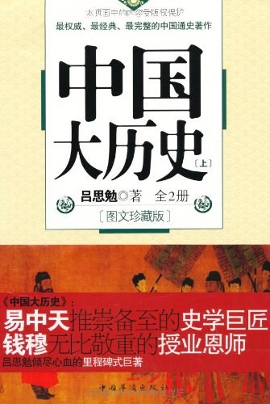

# 吕思勉《中国大历史》读书笔记

原文链接[在此](https://zhuanlan.zhihu.com/p/295370555)。  

从2020年11月开始读这本书并随手记录，到文章犯了莫名其妙的忌讳被屏蔽，不过两个月光景。  

自2021年1月18日凌晨3点起，还是在GitHub上继续写吧。  
以下为读书笔记部分。  

<hr>

## 目录
- [吕思勉《中国大历史》读书笔记](#吕思勉中国大历史读书笔记)
  - [目录](#目录)
  - [更新日志](#更新日志)
  - [开篇的闲扯](#开篇的闲扯)
  - [上册](#上册)
    - [绪论](#绪论)
    - [第一篇 上古史](#第一篇-上古史)
      - [第一章 汉族的由来](#第一章-汉族的由来)
      - [第二章 古史的年代和传统](#第二章-古史的年代和传统)
      - [第三章 三皇五帝](#第三章-三皇五帝)
      - [第四章 三王时代](#第四章-三王时代)
      - [第五章 春秋战国](#第五章-春秋战国)
      - [第六章 汉族以外的诸族](#第六章-汉族以外的诸族)
      - [第七章 中国古代的疆域](#第七章-中国古代的疆域)
      - [第八章 古代社会的政治组织](#第八章-古代社会的政治组织)
      - [第九章 古代社会的经济组织](#第九章-古代社会的经济组织)
      - [第十章 古代的宗教和文化](#第十章-古代的宗教和文化)
    - [第二篇 中古史（上）](#第二篇-中古史上)
      - [第一章 秦始皇帝的政策](#第一章-秦始皇帝的政策)
      - [第二章 封建政体的反动](#第二章-封建政体的反动)
      - [第三章 汉初的休养生息](#第三章-汉初的休养生息)
      - [第四章 汉朝的武功](#第四章-汉朝的武功)
      - [第五章 前汉的衰亡](#第五章-前汉的衰亡)
      - [第六章 社会革命](#第六章-社会革命)
      - [第七章 后汉的兴亡](#第七章-后汉的兴亡)
      - [第八章 秦汉时代的政治和文化](#第八章-秦汉时代的政治和文化)
    - [第二篇 中古史（中）](#第二篇-中古史中)
      - [第一章 后汉的灭亡和三国](#第一章-后汉的灭亡和三国)
      - [第二章 两晋和五胡](#第二章-两晋和五胡)
      - [第三章 南北朝](#第三章-南北朝)
      - [第四章 军阀和异族](#第四章-军阀和异族)
    - [第二篇 中古史（下）](#第二篇-中古史下)
      - [第一章 隋朝的内政外交](#第一章-隋朝的内政外交)
      - [第二章 唐朝的初盛](#第二章-唐朝的初盛)
      - [第三章 从魏晋到唐的政治制度和社会影响](#第三章-从魏晋到唐的政治制度和社会影响)
    - [第三篇 近古史（上）](#第三篇-近古史上)
      - [第一章 近古史和中古史的异点](#第一章-近古史和中古史的异点)
      - [第二章 唐朝的分裂和灭亡](#第二章-唐朝的分裂和灭亡)
      - [第三章 五代的兴亡和契丹的侵入](#第三章-五代的兴亡和契丹的侵入)
      - [第四章 北宋的积弱](#第四章-北宋的积弱)
      - [第五章 北宋辽金的兴亡](#第五章-北宋辽金的兴亡)
  - [下册](#下册)
    - [第三篇 近古史（下）](#第三篇-近古史下)
      - [第一章 南宋和金朝的和战](#第一章-南宋和金朝的和战)
      - [第二章 南宋金元的兴亡](#第二章-南宋金元的兴亡)
      - [第三章 蒙古的武功](#第三章-蒙古的武功)
      - [第四章 元朝的衰亡](#第四章-元朝的衰亡)
      - [第五章 宋辽金元四朝的政治和社会](#第五章-宋辽金元四朝的政治和社会)
    - [第四篇 近世史（上）](#第四篇-近世史上)
      - [第一章 明朝的对外](#第一章-明朝的对外)
      - [第二章 明朝的內治](#第二章-明朝的內治)
      - [第三章 清朝的兴起](#第三章-清朝的兴起)
      - [第四章 明朝的灭亡](#第四章-明朝的灭亡)
      - [第五章 清朝的盛世](#第五章-清朝的盛世)
      - [第六章 近代的蒙回藏](#第六章-近代的蒙回藏)
      - [第七章 近代的西南诸族](#第七章-近代的西南诸族)
      - [第八章 近代的后印度半岛](#第八章-近代的后印度半岛)
      - [第九章 清朝的中衰](#第九章-清朝的中衰)
    - [第四篇 近世史（下）](#第四篇-近世史下)
      - [第一章 中西交涉的初期](#第一章-中西交涉的初期)
      - [第二章 咸同时的大内乱](#第二章-咸同时的大内乱)
      - [第三章 藩属的丧失](#第三章-藩属的丧失)
      - [第四章 清朝覆亡和民国的兴起](#第四章-清朝覆亡和民国的兴起)

<hr>

## 更新日志

|修改人|修改日期|修改内容|
|-|-|-|
|朱里|2020.11.15|阅读第一篇，上古史。|
|朱里|2020.11.17|阅读第一篇，上古史。|
|朱里|2020.11.21|阅读第一篇，上古史。|
|朱里|2020.11.22|阅读第一篇，上古史。|
|朱里|2020.11.23|阅读第一篇，上古史。|
|朱里|2020.11.24|阅读第一篇，上古史。|
|朱里|2020.11.29|阅读第一篇，上古史。|
|朱里|2020.12.07|阅读第二篇，中古史（上）。|
|朱里|2020.12.08|阅读第二篇，中古史（上）。|
|朱里|2020.12.19|阅读第二篇，中古史（上）。|
|朱里|2020.12.20|阅读第二篇，中古史（上）。|
|朱里|2020.12.31|阅读第二篇，中古史（中）。|
|朱里|2021.01.02|阅读第二篇，中古史（中）。|
|朱里|2021.01.03|阅读第二篇，中古史（下）。|
|朱里|2021.01.09|阅读第二篇，中古史（下）。|
|朱里|2021.01.17|阅读第三篇，近古史（上）。|
|朱里|2021.02.28|阅读第三篇，近古史（上）。|
|朱里|2021.03.01|阅读第三篇，近古史（上）。|
|朱里|2021.08.22|阅读第三篇，近古史（下）。|
|朱里|2021.09.01|阅读第三篇，近古史（下）。|
|朱里|2021.09.02|阅读第三篇，近古史（下）。|
|朱里|2021.09.04|阅读第三篇，近古史（下）。|
|朱里|2021.09.05|阅读第三篇，近古史（下）。|
|朱里|2021.09.06|阅读第四篇，近世史（上）。|
|朱里|2021.09.12|阅读第四篇，近世史（上）。|
|朱里|2021.09.22|阅读第四篇，近世史（上）。|
|朱里|2021.10.01|阅读第四篇，近世史（上）。|
|朱里|2021.10.06|阅读第四篇，近世史（下）。|
|朱里|2021.11.14|阅读第四篇，近世史（下）。|

<hr>

[](https://book.douban.com/subject/10786457/)

## 开篇的闲扯

知乎这个编辑器，换行和分段还得区分着用，否则看着排版太难受了。  
本文为适应Markdown语法，所有段内换行都采用行末**两个空格**。  

我从小学开始就对古文情有独钟，第一本开蒙的《古文观止》翻了不下数遍。  
然而上学期间，显著的天赋却全在外语上。  
对语文考试不但没有优势，反而是历次升学的拦路虎。  
这些年借助外语的优势，在学计算机、搞AI上面倒是得了一些便利。  
当然，学了工科搞了CS主要是生计所迫。  
理想是有的，但饭也得吃。否则怕是已然穷死数年，草长得比我个子都高了。  

说到读闲书，最喜欢的还是古文，哲学、历史之类。  
虚度光阴三十年，至今没什么本事，所以还是个无名之辈。  
这点闲工夫可以有的。  

照理说之前刷公开课，增进理工技能的事，我还可以写写学习笔记。  
毕竟都是手艺人的事，学艺打工恰饭就是安身立命。  
我一个学徒做做笔记也是常规操作。  

而对哲学、历史这些，我是不敢随意开口评价的。  
一个普通工科狗写出来的东西，何止幼稚，简直愚不可及。  

但又怕自己不管读儒、道、兵、法的东西，还是纪传编年、稗官野史，  
每次都是铅笔划过，眼睛扫过。能记则记，能懂则懂。记了不用，忘了拉倒。  
那到头来我读了个什么呢？  
就比如《兵法》我通读过一遍，如今能记下来的恐怕还不超过十句。  
倒是三十六计好背，当元素周期表一样记了下来。  

年纪越大，记性越差，不比当年精力旺盛，过目不忘。  
还是不揣浅陋，写写杂记为好。  

上次陪父母逛王府井，路过唯一的书店还算冷清，对比外面的人山人海。  
看了一会儿没什么可买，又不想空手出来。  
就找了吕思勉先生的《中国大历史》上下册，也算是购物了。  

这本正好作为先生《中国通史》的导读。虽是导读，才看了一点已然吃力了。  
至于六册《中国通史》，还没有Steam上的3A大作贵，到底还是买书便宜啊。  
就作为几年内读完的一个大目标吧。  

以下内容随读随记，没有目的，没有保证。  
当然也没有价值。  

<hr>

## 上册

### 绪论

开篇先生对史学的研究方法进行了解释，我也联系古代经学家考据、训诂的思路，以及科学研究里的三范式进行理解。  
当然，作为外行，看得比较懵。  
也算是culture shock，隔行如隔山嘛。  
至少看完绪论，我完全没有写笔记的念头。  

### 第一篇 上古史

#### 第一章 汉族的由来

燧人、伏羲、神农。  
女娲=祝融。  
嗯。  
Facts or fictions? Let it be.  

#### 第二章 古史的年代和传统

“子曰：生而民得其利百年，死而民畏其神百年，亡而民用其教百年，故曰三百年。”  
这句透彻。  

一页纸里没听过的人名，罗列的公元纪年，令人对“皓首穷经”有了直观感受。  
以先生“聊胜于无”的算法推到公元前3274年，这上下五千年的说法也就出现了。  

#### 第三章 三皇五帝

混沌初开，想起了已故科学家John Horton Conway的Game of Life。  
“但知其母，不知其父。”  
母系社会近乎原始，模式发端于偶然，阶段性收敛则为必然。  

伏羲创立天文历法，燧人取火，神农传授耕种畜牧。  
神怪神怪，居功至伟则敬畏之至。  
没办法，封神吧。  
创世纪。  

轩辕祝融，武德丰沛。  
饕餮、穷奇、梼杌、混沌谓之上古四凶，除梼杌外谓之三苗。  
民族团结大于天。  

共和革命，共和国。  
我们如今的政体，取名居然发端于封建帝制肇始之前的西周。  
一如古希腊的民主探索和如今的西方民主一样。  
有趣的轮回，好古还是仿古？  
取其精华，去其糟粕。  

大臣评价帝王，个个直追尧舜。  
禅让，却不能细琢磨。  

“四岳里三个，倒就在‘四罪’之中，岂不可骇。”  
五千年前，和三千年前、一千年前倒也相似。  

只读儒家，百无一用。  
遍览百家，焉能不疯？  
（逃  

“世界究竟是‘进化’的”。  

大禹治水，上古传说。  
“社稷”中的后稷，也是辅佐大禹治水的人。  
这些上古拓荒者做出的贡献，是传承在整个文明里的。  
神话也是一种升华。  

#### 第四章 三王时代

羿是帝尧时的神话英雄，射日救民。  
后羿则是夏帝仲康时期的有穷氏领主，篡夏自立，后为门人寒浞所杀。  
羿和后羿相差数百年，因此“后羿射日”实为民间张冠李戴的典故。  

私以为，按照史料考据的难度，  
NLP技术就是再发展一百年也做不到针对古籍的自动推理。  
包括实体、关系抽取和消歧。  

本章中作者对皇甫谧的多处考据不严表达了鄙视。  
可见做学问上不严谨，过了几千年还要被人拿出来挂的。  
不可不察，告辞告辞。  

所以“既绌夏命还亳”到底是哪个亳呢...  
看这节看困了。  

伊尹放太甲，是中华历史上第一个“辅国”、“训政”的故事。  
是宪政里常常提到的上古案例。  

按《史记》的说法，商朝的兴衰波动倒是频繁的很。  
可能评判标准较后世不一。  
我们认知的一个王朝，能经历的中兴至多也就一两次吧，倒是衰败灭亡需要经历多世。  

西周起于戎狄，公刘施行仁义，士农工商（还没成型）各得其所，因此百姓归附。  
后来古公因战乱从豳迁到岐山，邻国百姓还愿意扶老携幼去投奔。  
这种千古佳话在三国时刘备下江陵又上演了一次。  
用脚投票还是最朴素的哲学。  

周公姬旦，不但摄政辅佐成王，而且平叛东征，最后能圆满归政全其忠名。  
文治武功，蜀汉诸葛武侯没做成的事，他在周朝已经做成了。  
近乎完人。  

《史记▪鲁周公世家》这段关于**成王评价已故周公**的引文，体现得最多的两个字是忠和礼。  
在“封建礼教”这个概念还不存在的年代，礼教二字确实应该分开来看。  
君臣**以忠则百姓归依，以礼则天下教化**。  
礼教礼教，这么理解也比较自然。  

先生用较多的地理史料考证认为周昭王是伐楚战败，渡汉水溺亡。  
随后的周穆王也是武功大于文治，对内制定法度，武力西征犬戎。  
这两代君主有点汉武大帝的味道，在那个普遍**崇礼崇文**的年代，穆王的一些事迹没有留在正史中可能也是史家的偏好使然。  

周公、召公是世袭罔替的爵位，周公旦、召公奭则是开国元勋。  
后来厉王时期国人暴动，周召二公共和摄政的时期，自然已经传了很多代了。  
只不过一般我们提到周公，都默认是周公姬旦。  
第一次看这个还迷惑了一把，查了资料才想起来西周分封制的概念。  

古代史料由于“正统”二字的影响，对少数民族都以“外族”、“异族”等比较敌视的方式看待。所以你从正史里能看的大都是帝王东西南北征伐、和亲、绥靖的记录。  
比如西周时期的**犬戎势力**，按照西周的国力来看，犬戎一直可与分庭抗礼。  
后期愈发强盛，甚至能联手申国灭掉西周。  
语言、社会形态都不一样，另一个视角的历史我们就知之甚少了。  

#### 第五章 春秋战国

从西周一统天下的局面过渡到春秋战国的群雄割据，这里头的有几个事情值得注意。  

商纣无道，凭借个人超强的反向操作一把断送了整个王朝。  
而西周帝位传了多代，雄主昏君，治世乱世，起起伏伏有过多次。  
但真要说万民弃之，周厉王算是一个。  
王室一方面对天下的统治力随着威信一起衰落，一方面对于皇室宗亲的分封并没有足够的约束。  
所以周王朝的概念是一步步走下历史舞台的。  

分封制在没有高压的中央集权约束下，好比一个大家庭。  
几世同堂还能其乐融融，分家各自生活了，因袭几代之后，纽带就非常弱了。  
所以春秋时期的“国”实际上对于这些王公来说也是一种“草创”。  
虽是草创，各国却由于文化、地域等原因，走的路非常不同。  

齐鲁大地，是我们提到“中原”时最容易想到的。  
继承了姜太公的衣钵，到了春秋时期能出孔子这位至圣，可能也有一定的历史必然在里头。  
孟子尊孔子，孔子尊诗书。儒家后来的“王道”思想，实际上践行的典范就是姜太公这位封了神的祖师爷。  
因此这种文化的一脉相承，是可以以千年计的。  

巴山蜀水、荆楚大地，相对中原来说就险恶得多。  
于是楚文化从诞生以来，就带着披荆斩棘、筚路蓝缕的意思在里头，武德丰沛的自然的。  
楚国的创立，可能用草创是最最贴切了。  

吴越两国倒是有意思，吴国起源于商朝后期，周室的宗亲闹意见出走，这一走竟南下蛮荒之地，传了几百年成了吴国。  
越国更是追溯到夏后帝少康的苗裔，论文明开化更晚。  
所以我们今天虽然都知道吴越战争，夫差勾践卧薪尝胆的故事，但这个故事似乎和其他的春秋史料显得很割裂，像游戏的DLC、外传一样。  
这是因为吴越古国在当时和中原就是不常往来，自成江南一支。  

其他中小国家，从宗谱、封地都能追溯到商末周初的主要人物。  
其中诸如微子启、伯夷、蔡叔度等读《史记》都提到过。  

春秋五霸，以齐桓公、宋襄公、晋文公、秦穆公、楚庄王为顺序，也难怪毛主席有“各领风骚数百年”的感叹。  

齐桓公，也就是公子小白。齐相管仲管夷吾，被后世认为是政治家的集大成者，以至于后世评东晋名相王导，还有个“江左夷吾”的说法。  

宋襄公，子兹甫，不查你都不知道他叫什么。在五霸之中常常是存在感最低的一位。  
齐桓公死后，宋襄公有一番雄心壮志，但能力、机遇似乎没有给他大放异彩的机会。  
查了一些资料，这个最不起眼的五霸反而成了一个值得琢磨的问题。  
毕竟**最好的问题、最难的答案往往出自两可、两难**之间。  

晋文公，大名鼎鼎的公子重耳。早年因为帝位争夺而被迫流亡外国，这让他相比其他国君有多了一段传奇经历。  
只能说对于天赋异禀的人，在苦难中磨练心智是非常科学的。  
晋楚争霸，留下了退避三舍的典故。  

秦穆公，嬴姓赵氏名任好。晋楚争霸时期，秦国励精图治，没有参与晋楚的全面战争。因此能在晋衰楚兴的局势变化中保持稳定。  
距离战国时的大秦雄视天下还有四百年，春秋的秦国稳如狗。  

楚庄王，芈姓熊氏名旅。晋文之后，三世而衰。楚国在与晋国的长期斗争期间，各有起落。  
楚庄王有为而晋灵公无道，则自助者天助之。  
尔后晋楚征伐依然不断，全面战争直到两国都走向没落，也没有统一。  
乱局再起，最终华约北约都是过眼云烟。波兰乌克兰表示，还是各回各家。  

五霸相继衰微以后，吴越战争的时代就来了。最终勾践灭吴，已经名存实亡的周王室还给他封了个伯。  
袁世凯想了想，哈，这天下哪轮得着他。  

```
舜发于畎亩之中，傅说举于版筑之间，胶鬲举于鱼盐之中，管夷吾举于士，孙叔敖举于海，百里奚举于市。
故天将降大任于是人也，必先苦其心志，劳其筋骨，饿其体肤，空乏其身，行拂乱其所为，所以动心忍性，曾益其所不能。
```

高中课文就有这段孟子的“生于忧患死于安乐”。  
其中管夷吾相齐，孙叔敖相楚，百里奚相秦，都是春秋五霸的辅国名臣。  

春秋时代落幕，战国来了。  
这个时代是如今为人津津乐道的、最奇幻的年代之一（随后可能是大唐和带明）。  
读书人则比较关心诸子百家留下的思想遗产，还有国策国语里记录的那些历史典故。  

战国七雄中，晋楚强大来自于春秋时代的积累。秦国开局起点并不高，其他国家的成型各有一番惨淡经营。  

秦国在战国前半段以边陲弱国立足，他国以等闲视之。  
孝公重用商鞅，以严苛法制代替**容易模糊、拖延、歪曲**的德治。  
从国家发展角度看，这和**科技强国吊打道德文章**倒是有异曲同工之妙，正所谓降维打击。  
当然，秦不尊孔孟二世而亡，那便是后话了。  
这其中的扩张和征伐，招核自然招核，但先生文中提到的“自完主义”，倒是和我们如今中国讲的**内循环**有点类似。  
内循环不是闭关锁国，但民生、经济、军事命脉绝不能任由他国觊觎和威胁。  

公元前246年，秦始皇统一六合。商鞅、李斯、白起之类的人物，可能留在历史上的形象还是令人不寒而栗的居多吧。只能说求仁得仁。  
秦相吕不韦，姜姓吕氏，姜太公二十三世孙。虽然晚年也未得善终，有《吕氏春秋》流传至今，也算是为后世提供了宝贵的见证。  
我也买了本，还没看过。  

“只有新进于文明的野蛮国家，才最为可怕。”  
这大概说的不止是秦国，还有昭和维新的日本，和我们结束几千年封建帝制的共和国吧。  
苟日新，日日新，又日新。——《礼记▪大学》  

#### 第六章 汉族以外的诸族

西戎、北狄、南蛮、东夷，这四个字本是**按方位**来区分外族势力的，不是说人家民族就叫这个。  
然而古代的中原人对外族本不甚重视，更谈不上多友好的外交，后来便连叫法都搞乱了。  

比如西汉时期我们熟知的匈奴人，祖辈来自獯粥族，按中原方位来看便是西北的戎狄。  
由于獯粥族大都以游牧部落散居，难以与中原各个王朝抗衡。  
所以历史流传下来只有善于齐射又能在平原地带群居的匈奴部落，与汉朝留下了大规模战争的记录。  

鲜卑和乌桓出自古老的东胡部落，前者在南北朝时期建国北魏做了一回主人。后者则在三国时期和曹魏交战败给了曹操。  
后世成百上千年，既未灭亡也未称霸，各自发展。  
几千年下来，经过多个朝代的迁徙、通婚和文化融合，如今已经逐渐和汉族同化了。  
兄弟姐妹都很多，景色也不错。  
虽然国际化大背景下，地球村也是一家...  

氐人羌人，一个在天府的巴蜀，一个遍布中亚高原到我国的大西北。  
虽然山高水险，巴蜀人民的艺术天赋倒是几千年从来不缺，有意思。  
如今还是rap圣地。  
至于羌人，自古和中原往来不多，兵事更少。  
关系就算不错，也有向中原朝觐的记载。  
三国锦马超，身为汉人也有羌族血统。以边关大将的威名保证了蜀汉和羌人的治安稳定。  

说到南蛮，开篇三皇五帝追溯时提到的**黎族**，便是其中之一，流传至今是我们的苗族同胞。  
至于“粤”和“越”，我也傻傻分不清。  
按“断发文身”的说法，两者倒是雷同。  
“粤”字流传至今，血脉遍布中国南方从闽南地带到整个东南亚；而“吴越”今天则对应我们印象中的江南水乡，两江两广，尤其江浙苏沪。  
可见粤和越自然也不是什么泾渭分明的概念，发于同源而开枝散叶。  

濮族，在我国如今的云南地界。原来夜郎国也是云贵区域的，不查我都不知道。  

#### 第七章 中国古代的疆域

这张讲的“服”虽然不是什么精确的地理概念，但要从古代人认为**天圆地方**的角度去看。  
于是可以理解为二维平面上的欧式距离。  
虽然张衡在东汉时期已经认为地球是个球，但中国人观念上普遍接受这个观念，恐怕明清时期外国人带了地球仪过来，才算眼见为实。  

看困了，真一个茫然无所得。  
鉴于我们的古人对世界的物理规律的认知，天文第一。  
地理跟天文有关，但肯定不是我们那套“合乎天数”的做法。  
于是先射箭后画靶心的事情怕是不少。  
云台二十八将，孔门七十二贤。我们对于押韵和凑整的热情，几千年没变过。  
天文学家并不被视为科学家，而是个典礼司祝的活儿。  

不过从方法论来看，这两种思路来测量古代疆域还是合乎逻辑的：  
其一，实力所及，有兵争和统治的地方。  
其二，声教所及，有文化传承记录的地方。  

#### 第八章 古代社会的政治组织

动物群居，是为了求生存繁衍。  
人类从原始社会开始便也没什么不同。  
血脉相承，所以宗室的概念倒是很自然。  

但皇、圣、贵胄这些是怎么来的呢？  
我倒愿意用宇宙尘埃从混沌到凝聚，逐渐坍缩为天体的道理去类比。  

就比如形成地球的元素吧。  
氢氦轻，要么飘在大气层外，要么干脆飘到光年之外。  
铁镍重，下沉聚拢而成为地心。  
氢氦在上，铁镍在下这是历史的必然。  
说来金银比铁镍更重，为什么我们的地心不是金银，地幔不是铜铁呢？  
这个你得问宇宙大爆炸怎么安排的，这是概率的偶然。  

为了生存要争斗，争斗就有胜败。  
成王败寇连其他动物也要遵守，不独人类。  
于是人类社会的尊卑上下也是出于自然。  

至于分封制的产生，也非常自然。  
你想想你从一线的打杂小弟，升职到项目经理，再一路干到企业老总。  
分蛋糕、派活儿、管人，不就这么回事儿嘛。  

真正开始non-trivial，是“以孝治天下”观念的产生。  
在**不重视法治观念**的社会里，**家国一体**。  
家和出于孝悌忠信，于是人们也会认为治国也靠这套。  
实际呢？只有儒道并举，在较为理想的状态下才能做到。  
从“兴灭国继绝世”的说法里可见，**忠恕之道**在上古时期已经有了。  

只凭忠恕道教化人民，自然是百无一用的。  
封建封建，国家法度和强制力就该登场了。  

公侯伯子男，英文对应duke、marquis、earl、viscount、baron。  
其实中外的爵位，历史背景和年代差异极大，是由外国传教士在18世纪翻译流传下来的说法。  
虽然在当今资本主义日益盛行的中国，手握房子、股票的人也逐渐有点**资本贵族**的味道了。  

接下来先生援引《白虎通》《左传》《孟子》等给我们讲了下上古国家统治的KPI玩法。  
当然，述职这个今天依然日常使用的概念，其实孟子就提过了（听谁说的呢）。  
画风就很主流，根正苗红。  

公卿在内，诸侯在外，论亲疏远近是内贵于外。  
但公卿禄而不嗣，诸侯既禄且嗣。  
按我们中国人习惯性的**对于权力的至高追求**，诸侯美滋滋大成功。  

天公司马，地公司空，人公司徒。  
凑数凑数，凑的就是个天数。  

看古代的官制、地制最大的感受，就是数学模型都很朴素，都是逐级累乘的金字塔。  
但用的官职、地理区划却非常多，还都是一个字的叫法。  
这和现代人习惯的**按维度拆分**再进行**不同组合**的构词法，是不一样的。  

先生在这节的注解里都说枯燥无味。  
一个史学大师都看着烦，这部分的考据怕是看吐了不知多少次吧。  

“庶人之子孙，积文学，正身行，则归之卿相士大夫。”  
“徒设此义，不能行也。”  

关于教育选举这节，前半段关于贵胄、平民教育的部分倒是让人看得昏昏欲睡，毕竟诗书礼乐，所谓教化是为了永久统治。不存在任何求变求新、探索自强的意思。  
倒是从周王朝式微，曾经入官学的士人流落到平民当中，教育这事才真的开枝散叶。  
这也是诸子百家，道行天下的契机。  

同样有意思的是，在礼崩乐坏的战国年代，士人里的杰出者一方面孕育了流传后世的很多思想遗产，一方面又当着唯利是图的政治雇佣兵，把战争和灾祸引向普通百姓。  

先生在引用《群经补义》中提到了古代的征兵制度。按《管子》的说法，古代的征兵入籍，入编参战，复员（误）务农和我们如今也没有什么天大的区别。  
只不过几千年农业大国，士兵除了军籍自然是回家务农为主。  
对于军队的规模，按文中所述主要以拱卫都城，巩固皇权为主。  
所以我国虽然幅员辽阔，四海的百姓离都城远的，也不是都要服兵役。  

先生在兵制这章的一个主要论点是我国自古没有“兵农合一”这回事。  
不过我党的工农革命斗争，尤其解放战争时期在几个解放区的建设，倒是游击战 + 屯田制的好例子。  
地小，人少，实力弱，只能拿起枪就打仗，放下枪就农忙。  
形势各异，办法也就不同了。  

季氏、阳货这些当时的大野心家，没几个人记得他们的功与罪。  
管仲文韬武略，能有《管子》传世。  
还真是不废江河万古流。  

有了仁者爱人、无为而治的儒道双修，我国的法制观念就和科技观念一样，几千年也没有作为立国之本。  
自然，也就成不了强国之道。  
“其政昏昏，其民淳淳。其政察察，其民缺缺。”  
错吗，不错。有用吗？没用。为什么要有用？不为什么。  
虚无、模糊都是不行的。要系统，要严谨。  

不过，这章里倒是有三点我觉得挺有意思：  
其一，开始的刑罚观念是倾向于神秘主义，**威不可测则莫敢不从**。  
这个自然在法制建设上验证了走不通，却成了政治权谋的基本原则之一。  

其二，关于刑不上大夫，从先生的论证里倒是没看出太多**对于特权的议论**，宗法社会本没什么好辩的。  
倒是让人看到满满的“**维稳**”画风，这二字的地位倒是五千年不变。  

其三，秦国强盛的一个原因是在战争年代选择法家而不尊儒道，加上本身民风彪悍，文化也离经叛道。这么个剑走偏锋的王者...今天的字节跳动可与一战否？  

#### 第九章 古代社会的经济组织

历史记载基本都从**农业社会**开始，因为游牧渔猎的民族没有什么可以记录历史并随身带着走的东西。  
不安顿聚居的话，恐怕堆个巨石阵也没那精力。  

本章开篇提到了我国古代田赋制度的“贡助彻”法。  
**贡法**指农民的部分耕作畜牧，进贡给贵族，类似交税。  
**助法**指农民在耕作自有田产，自给自足的基础上，还要共同耕作助田供养贵族。  
彻法介乎两者之间，能查到的资料都不甚确切。  

伟大革命家孙文和黄兴对于**同盟会会旗**的一段争论，就在于旗帜上要不要有井字样式。  
用井田制代表“平均地权”，是一种借上古制度表达朴素理想的方式。  
但事实是生产关系和生产力说了算。  

“无君子莫治野人，无野人莫养君子。”  
这放在今天就是没法翻译的一句话，因为这不PC。  
不过读书人要时刻记住，士农工商各得其所。  
要是读了点书就高高在上，那就算是书读到狗肚子里去了。  
“吃穿都没了，你还臭美啥？”  
话说回来，说这话的人好像也...嗯，是吧。  

《食货志》里的这段描述，倒是让我想起了范成大的那句诗。  
“昼出耘田夜绩麻，村庄儿女各当家。”  

《王制》曰“无三年之蓄曰国非其国也。”  
蚂蚁金服狂喜，存款准备金率暴击。  
金融是个好东西，发明初衷是搞活经济。  
但如同科技一样，用法千变万化也就无所谓双刃剑了，N刃都挡不住。  

我国自古是农业大国，到今天依然是。  
庄稼人日子过不下去，是要出大事的。  
倘若二十年后，我国会不会不再是农业大国了？  
不敢多想，很危险。  

当我们说生产关系生产力的变化，进而造成社会形态的变化，就不要说什么“崩坏”了。  
毕竟古朴古朴，你认为它朴素可以，但朴素只代表天真又简单，不代表它对或者好。  
人总要长大，天真的日子是幸福的，但长大成了人就不不能继续天真。  
所以我这人虽然好古，但断不能仿古。  
如齐白石先生所说，“学我者生，似我者死”。  

贫富代替了贵贱，自由代替了共产。  
这么看从西周到秦汉的“礼崩乐坏”倒也可以。  

看完工商两节，居然没什么写笔记的欲望。  
工业、科技这些自然是天翻地覆。  
但看我们今天的商业逻辑，尤其那些民生根本的东西，和几千年前实在没什么本质区别。  
不能说的如今照样不能说。  

#### 第十章 古代的宗教和文化

古代哲学的东西，尤其关于创世理论，在孔孟、老庄、周易里都有不少篇幅。  
尤其后两者，老庄文风浪漫，周易则更系统。  

任何时代的科学方法，对世界的描述都要受限于**当世的认知水平**。  
比如所谓all mighty、higher power这些说法。  
我第一次知道牛顿的万有引力定律，就觉得这才是宇宙真正的造物主。  

人性的变化恐怕要按照**物种进化**去考虑时间尺度，所以五千年也还好。  
但科学技术日新月异，《周易》自然不必看它了，遑论什么《推背图》。  
现在是21世纪，去看统计机器学习吧。  
脑子好胆子大的，直接去学数学物理吧。  

你要说**天地玄黄**，按现在天文学理论可以这么理解。  
远古的光离我们有上百亿光年，还没传过来所以宇宙深空一片漆黑。  
尘埃坍缩为天体也要经过上亿年的旋转凝聚，冷却之前就是个大火球。  
当然，如果是气态巨星，总也不会凝聚，更像个棉花糖 + 糯米团子。  

关于“道法自然”这事，倒是我过去几年退学、裸辞、玄修的一个思想。  
很难说是为了蛰伏之后突然跳出来，去求个什么功名，还是单纯的发疯犯傻。  
蠢归蠢，蠢不等于错，错也不等于无用。所以不必急于否定。  
道法自然，能让我求得人生的幸福圆满吗？  
且看吧。  

洛书之数，查了下原来是3*3幻方。  

我国的某些宗教，尤以儒教为首，几千年主要的任务是教(tong)化(zhi)人民，所以这一节关于宗教的叙述看着就挺无趣。  
无趣不在于科学的匮乏，这本无可厚非；而在于刻意的神秘主义，深不可测则威不可加。  

语言文字是逐渐积累产生的。  
书写、印刷的技术发展缓慢，所以古人读书本身就不那么方便。  
由此去理解古人读书、科举、取仕这一路走来，动辄十几年几十年，也就好理解了。  
如今的LeetCode周赛那叫一个手速。  

按照司马谈对学术的发端归类，有儒、道、阴阳、法、名、墨、纵横、农、兵、医。  
这其中，农、兵、医中包含了专门的科学技术，和其他比较“务虚”的哲学不太一样。  
当然兵家是虚实兼有的，其中《兵法》十三篇至少有十一篇是纯粹的哲学经典。  
纵横家和兵家不一样，类似文臣武将，前者入相后者出将。  
儒家和名家也不一样，虽然到了宋明理学时，儒家正统几乎变成了名家。  
墨家在中国主流文化里一直比较边缘，一方面宗教色彩浓重，一方面孕育了侠义精神。  
道家虽然讲究无为，但许多帝王尊道家为君道，而儒家为臣道。很好理解，对吧？  

### 第二篇 中古史（上）

#### 第一章 秦始皇帝的政策

“二世三世，至千万世，传之无穷。”  
当世无敌，二世而亡。  
天下大势，浩浩荡荡。顺之者昌，逆之者亡。  
还得听国父的话。  

论反人类暴行，秦始皇当然不是第一人。  
但焚书坑儒一方面导致诸多古籍失传，毁坏中华文明其罪一；作为首次统一中国的始皇帝，走了暴君路线其罪二。  
只能说罪有应得，两千多年到如今他也就定性成这样了。  

秦朝对中国的功绩，从武功角度看还是肯定的。  
留下了万里长城，并且基本划定了疆域范围。  
至于阿房宫，当然是过眼云烟了，怎比得《阿房宫赋》的不朽。  

后代革命者声讨封建帝王，都以“独夫民贼”称之。  
秦始皇对于帝制的重新定义，称得上“始作俑者，其无后乎”了。  

#### 第二章 封建政体的反动  

赵高是中国历史上第一个站在聚光灯下的宦官。  
结果呢，奸人、恶人、罪人的极致。  
历史上的宦官形象从他开始就没起个好头。  

《封神演义》里的闻太师，其实指的是越国的文种。  
这章里提到的连续挫败反秦起义的名将章邯，还有诸如明朝的孙传庭，都是各自时代的悲剧人物。  

我们说封建帝制，总要以“反动”称之。  
看看秦朝从始皇登基到楚汉灭秦短短的时间里，君臣、骨肉互相欺骗、倾轧、谋害。  
该干的不该干的都干完了， 秦王朝也就气数尽了。  
逆潮流而动，就是反动。  

各路诸侯起兵反秦，都要拥立王侯子孙，这倒是古代的一贯理念。  
任你兵强马壮，师出必有名。无名则为乱臣贼子，人人得而诛之。  
类似后世**虚君立宪**的政体制度。  

按照穷则思变看，王侯、士大夫这回穷了，庶人革命在反秦斗争中成了主流。  
载入史册的这帮人居然以匹夫、游侠、基层官吏为主。  
只能说差异化竞争是个好东西，你不知道能孵化出什么来。  

汉高祖清洗功臣、收拢权力，吕后擅政弄权，这都是权力的自然发展，自然腐败。  
到了文帝，以无权无势起步，能以仁德流芳百世，而让汉王朝重回正轨。  

历史评价晁错，当然是个十足的好人。义无反顾，舍生忘死。  
但政治智慧和私人品德是两回事。  
贾谊和晁错，一个狂生一个义士。  
还是贾谊的招儿好使。  

周亚夫，胡宗宪。  
读历史看到能臣、忠臣、名臣，总会想想是不是后来含冤下狱，不得善终了。  
风云际会，造就英雄。  
可它毕竟是风云，不知哪片云彩有雨，有雷。  

#### 第三章 汉初的休养生息  

文景之治能在历史留下一段佳话，主要两个前提：  
- 汉朝建国以后的权力争斗和大清洗基本结束。  
- 不管当朝还是前朝，上上下下都不堪动荡了。  
  
所以人不能和天性作斗争，这实在是历史必然。  

海瑞的《治安疏》里评价文帝有句“优游退逊、尚多怠废之政”。  
这几十年的安稳日子，也换来了下一次的蓄力爆发，也就是汉武大帝。  

#### 第四章 汉朝的武功

“其行径，颇不敢保他正当。因此当道诸国，皆以为苦。”  
按理说战场上强大了，则外交就是力量。  
所以汉武帝对西域诸国的总体战略是先打出威名，然后不战而屈人之兵。  
结果出使的使臣们居然沿路盘剥勒索，也就给国家一路抹黑。  
最终的结果是老大的战略没实施，西域诸国倒有几个反叛了。  
可见**大事上用人**，贤德第一，才干第二。  

西汉设立了西域都护府，这种由当地驻军来屯田戍边的传统，到今天依然存在。  
我们建国后的新疆生产建设兵团就负责承担这个职责。  

地理位置和疆域对一个国家的命运是有决定性影响的。  
比如文明大都诞生于水边，发达地区不论地理还是气候都没有特别极端的。  
就说疆域的维持，也看所处位置是否有利于发展经济、文化。  
我们的武功在秦皇汉武两帝，基本确立的中国今天的版图。  
对**遭受侵略和战败**的西域诸国来说，汉武帝当然也是军国、帝国主义的代表。  
世界上其他的大国，在各自的军国主义、帝国主义当权的时代，也为**自己国家的利益**进行了征伐、扩张，给**世界带来深重的灾难**。  
比如美国总统**西奥多罗斯福**，就是美国扩张主义的先锋。  
换个角度，看法很就不一样了。  
其实，客观说，一样。  

所以这儿其实得明确一个原则：  
做大事，尤其是**报效国家**，于个人品德上，可以说崇高程度仅次于造福全人类。  
但为国尽力也要面临很多**个人道德和集体道德的两难**，国家利益常常和个人品德追求有所冲突。  
需要取舍和牺牲。所谓千夫所指，义无反顾。  

#### 第五章 前汉的衰亡

西汉初年由于生产力不足，居然有鼓励民间采铜铸币以便商业流通的政策。  
不管古代人现代人，对于货币政策的严肃性、重要性是毫不质疑的。  
果然到了汉武帝时期，民间铸币造成的市场混乱被统一的**中央货币政策**所取代。  
“今农事弃捐而采铜者日蕃，释其耒耨，冶熔炊炭；奸钱日多，五谷不为多。”  
**经济学规律**谁也不能违背。  

文治武功当然文治在前，因为和为贵。  
先生在第一节最后，把对汉武帝的评价摆得很低。  
毕竟被杜甫的《兵车行》拿来借古讽今的，  
正是这位把文景之治的家底折腾一溜够的，武皇帝。  

关于迷信方士，古代人普遍封建迷信我们且不说它。  
就说一个盛世（区别于治世）的君主，前半生举世无敌。  
这样的人必然也积攒了**半生的业报**。  
晚年玄修求个解脱，则是再强大再富有的人也脱不开的**人性**。  
大明嘉靖皇帝前半生也是建功立业的人，说**刚愎自用**也好，**不可一世**也好。  
老了就看出黄老之道的好了，然而**黄老之道**可不是吃**硫化汞**吃出来的。  
封建迷信要不得，食品科学搞起。  

“研究历史的目的，在于把古今的事情互相比较，而观其会通。”  
这样读历史就不只是**逛逛故事会**，**更不能站队**先定个好人坏人。  
因为历史自有公论。  

“所以这些‘偶像’，不能不打破它。并不是要跟死人为难。”  
科学精神不灭。  

评价霍光有时和伊尹放一起，有时和曹操放一起。  
错吗？都不错。  
就是论实际施政的政绩，也可以和他所争权的汉宣帝放一起。  
人是多维度的，各维度也没有非黑即白。  
要**打倒**吗？宣帝把他打倒了，因为他是当朝权臣。  
要**永远打倒**吗？当然没有，你看历史给他的评价就很公正很多面。  
所谓争议，都是留给后人争了。  

古有王莽，今有袁世凯。  
都是**旷世奇才**，也都被盖棺定论为**大奸人**。  
可就说“奸人”二字吧，这里头就带着私欲。  
私欲太大的人，是聪明不到哪儿去的，单论眼界就不值一提。  
所以这二人实在是无法评价的枭雄、鬼雄。  

#### 第六章 社会革命

本章开篇引了《食货志》中晁错的一段话。  
讲到了文帝时期**政治宽松**，于是民间经济也颇有如今**自由市场经济**的味道。  
自由市场，自然就是从无序扩张到寡头垄断，进而发展成资本豪强鱼肉百姓的情况。  
所以才有“文帝不**正其体**，而务除租税，**适足以资豪强**也”的说法。  
读了这段才对海瑞的《治安疏》里对汉文帝的评价，还有我们国家的很多政策推行有了体会。  
即使**出发点利国利民**的方针政策，如果没有**足够科学全面的调查分析**，施行起来也可能**适得其反**。  
资本主义的发展带来了**生产力的大幅提升**，同时的副产物则是**阶级和贫富的分化**。  
凡事没有尽善尽美，只能取长补短，所以我们叫**中国特色社会主义**。（嗯）  

先生在这章说王莽迷信法治，我以为看到的是秦朝的法家苛政。  
结果是“**制礼作乐，讲和六经之道**”，似乎是很合事宜的。  
然而为什么失败了呢？因为王莽大半生苦心经营，有广泛的士大夫基础，却没有足够的群众基础。  
所以他一路**向上管理**爬到了顶端，称得上临渊履薄。  
但他登台以后的理想和抱负，也在他手下的向上管理中，付诸东流了。  
**同一个体制**的游戏，你赢了未来的你，必然也输给过去的你。  
**专制政体**容易培养出**唯上、媚上的小人**，这也算是这种政体的秉性吧。  

王莽最神奇的除了他政治纲领的穿越风格，就是关于他忠奸的辩论。  
我还是选择“**论迹不论心**”。  
一个人装一辈子好人，到死也不做坏事他就是好人。  
一个人吹一辈子牛逼，到死也没打脸，他就是牛逼。  
至于篡了大汉的位，大奸大恶自然是汉朝留给他的评价。  
我们的国父**孙中山是伟人**，一生行止可谓至善，但和决裂的陈炯明也不是恶人。  
路都是自己选的。  

#### 第七章 后汉的兴亡

匈奴的内部部落分裂，加上东汉章帝时对匈奴的征伐，居然让其中一支远走欧洲，成了今天的匈牙利。  
这个距离，对他们民族也是一次史诗级的迁徙了。  

从西汉开国的**吕后夺权**，到最终东汉灭亡分裂为三国时代。  
先生用了多处事例来论证**外戚**这个特殊阶级的**兴起和灭亡**，在那个阶段实属历史必然。  
古代的家天下是一姓的，但天下人却有百姓。  
所以这**一姓天下**就是由制度**强行约束**的，只要有一个机会，其他姓必然要来争权。  
我们说一个制度腐朽落后了，要淘汰它，自然要分析它**为什么不行，怎么才行**。  
比如在外戚掌权之前，封建的诸侯王排在前面，是七国之乱让分封制走向了末路。  
汉朝从始至终，也没有走出这个**制度缺陷**。  
**任人唯亲**这四个字，本也是人性。  
“天下为公”需要圣人的修为，可遇不可求。  

先生在第三节以外戚为例，提到一个阶级不到它该灭亡的时候，人们就只会责怪、怨恨**阶级的个人**，而不是这个**阶级本身**。  
关于**社会觉醒**问题，当然也有矫枉过正的时候。  
比如觉醒过于强烈时，凡事便又总是**扣上阶级的帽子**，余下不表。  

#### 第八章 秦汉时代的政治和文化

第一节中的官制介绍，和前几章关于先秦时期的官制有不少沿袭。  
比如三公里，司马变成了太尉，其他两个不变。  
光禄寺、鸿胪寺这些在后世一千多年也都存在。  
凑数现象也是普遍的，譬如国人对于三六九就情有独钟。  
我们都知道三公六部九卿，汉朝则是九寺六卿。  

“刺史”的刺是**监察**的意思，相当于对地方行政长官起到**监督作用**。  
但发展到后汉时期，刺史已经是一个州的实权行政长官。  
这就有点像我国目前**地方一把手**一般是**党委书记**，平级的行政长官则位居其后。  

第一节末尾对于州县乡亭逐级往下的官制，讲到了在从上至下逐渐**从法治过渡到德治+自治**的管理方式。  
其中“三老”这个概念就是**乡贤制度**的典型体现。  
这种制度在资本主义不发达的情况下，还能做到**小范围的民主自治**。  
一旦资本发达了，就会变成**土豪劣绅**用钱**玩弄选票**的舞台。  
过去十年我国在地方打击黑恶势力的成果，就是一个证据。  
乡贤制度不能**完全说**它是**旧社会的糟粕**，要随社会发展去做调整。  

叔孙通是《史记》和《通鉴》都写了的人。  
可能是个和管夷吾一样的奇才，但这辈子却一直在乱世夹缝里求生存。  
有意思，不容易。  

“窃见当今年少，不复以学问为本，专更以交游为业。国士不以孝弟清修为首，乃以趋势游利为先。”  
教育产业在**精英化、产业化、快速扩张**的情况下，就容易出现这种坏风气。  
今天的名校，尤其在中美两国这种情况也很普遍。  

至于**私人教育**，这个早在先秦时期就是**名士配讲坛**了。  
这种自发的教育形式在任何时代都普遍存在。  
如今的学者网红、KOL也会开开播客，发发视频，讲讲见解。  
古代的名士，尤其在野者，搞个几千上万学生听讲座还是可以有的。  
反正警察叔叔不管。  

第四节中对兵制的讲解比较详实，当然当兵自古以来就是排在读书取仕之后。  
但汉代人民沿袭了先秦的**尚武风气**，总体都是能打敢打的。  
于是先生又把秦皇汉武的**瞎打乱打**给狠批一顿。  
这么看来，**秦皇汉武**的武功倒和**乾隆皇帝**的文治盛世有的一比。  
既有天地人与之，也有前人积累的功业在里头。  

如今的世界，我国是志愿兵（经济建设），韩国是义务兵（地缘紧张）。  
要说**团结紧张严肃活泼**，东亚的韩国要数第一了。  

西汉名医淳于意因冤狱坐肉刑，结果小女儿缇萦为救父亲，  
以一人之力（当然不可能）竟能上达天听，**感动文帝**颁旨废除了肉刑。  
这件事的**传奇程度**比施剑翘刺杀孙传芳都有过之而无不及。  
但法度毕竟是维护国家统治的工具，所以秦汉时期的法律依然是严苛而野蛮的。  

汉朝的立法和司法直接沿袭秦朝法度，最初的奠基者则是魏国的李悝。  
然而汉朝总体只求吸收，而没有系统的**整理和改良**。  
在立法执法过程中，随用随加，导致法律体系**臃肿而混乱**。  
这和我们现在有时做事不讲章法，不得要领一样。  
如果东西都是糊的，攒的再多也称不上强大。  
不成体系，也就不能完备。  

第六节提到了“申韩之术”。韩自然是韩非子，申则是申不害。  
法家三派，慎子讲势，申子讲术，商鞅讲法。这是韩非子说的。  
申子这个“术”，后来也就成了**帝王驭下**的独门学问。  
通俗点理解，也就是权谋、斗争、制衡神马的。  

第六节先生对儒家的地位评论很客观，没有将它打成**封建专制的招魂幡**。  
到底是**儒家为专制服务**还是**专制在百家中选择了儒家**，我个人肯定认同后者。  
因为读《论语》《孟子》时都能感受到两位圣人对**辩证**二字的坚持。  
孔子本人是断不能接受后人**封他为圣人**的，遑论对他**顶礼膜拜**了。  
看历史**用今人眼光评判古人**是大忌，这样是免不了**先入为主**或者**因果倒置**的。  
那句“回也非助我者也，于吾言无所不说”就是很辩证的。  

### 第二篇 中古史（中）

#### 第一章 后汉的灭亡和三国

本章开头讲了羌族的起源和迁徙历史。  
从中原统治来看，羌族的进犯始终是个亦痛亦痒的事，却从来不是致乱之源。  

“今察洛阳：资末业者，什于农夫；虚伪游手，什于末业。”  
当然这句里的“末业”指的农业以外的其他工、商业，在今天都是社会运转的关键部分。  
但这句主要的意思在于，一个社会的支柱产业（古代中国当然是农业）如果衰落了，那社会秩序就会开始崩塌。  

当我们说腐败时，不管是资本腐败还是政治腐败，核心都在权力。  
只不过由于政治制度不同，掌权的人不一样。  
中国是重权轻利，所以掌权的人控制资本。美国重利轻权，所以财团控制政府。  
所以，腐败只和权力的无监督滥用有关。  
而资本家和官僚不管谁掌了权，学坏了都一样。  

**中央集权**的崩溃过程往往是个**滑滑梯**。  
比如吏治腐败，机构臃肿，问题就开始多。  
问题多了，就要下大力气整治，整治就需要资源去协调和推进。  
推进就要简政放权，放权就要削弱中央集权。  
放了权，地方行政长官就有了各行其是的舞台。  
这时对于中央的效忠和对于全局问题的处理，就开始和地方政府的内部利益产生**微妙的博弈**。  
如果不放，那就是毫无改观的僵持，**可能不错，但基本不对**。  
虽然从政治角度看，**不错一般等于对**。  

这就是国民党败亡之前“**反腐亡党，不反亡国**”的两难境地。  
究其原因呢？滑滑梯到了一半，你已经停不下来，也爬不上去了。  
一个体制要瓦解时，肯定在内部早已四分五裂。  
就像东汉的**州牧**和民国的**都督**一样。  

要稳定下去，只有从一开始就居安思危，时时事事战战兢兢。  
要不怎么有“治大国如烹小鲜”的说法呢。  

从十常侍之乱以后的事情，就是千古传唱的三国时代了。不得不说文学是不朽的。  
先生用两页的篇幅讲了下三国的大事记。  
东吴的崛起是一个历史性的变化，江南地带逐渐走向水土丰饶、文明兴盛，就是从江东子弟的这番打拼开始。这和之前中原文化以北方独尊的格局就不同了。  
魏蜀吴三国，分别占了个王道、仁德、才俊，神奇的**大时代**。  

#### 第二章 两晋和五胡

三国时期也就一百年，在中国历史上并不上长，但很璀璨。  
随后的晋朝则走了物极必反的路子——中国史上最烂的朝代（可能没有之一）。  

如果说权力争斗最能暴露人性的贪婪、残暴，那晋朝从开国到八王之乱，再到五胡乱华。  
自始至终就没有一个人**拿出纲领**，你死我活的斗争和非洲大草原的野狗就没太大区别。  

继承西晋乱臣贼子的“优良传统”，五胡十六国的主题也很一致——无休止的**夺权和杀戮**。  
还伴随着**种族清洗**。  
你看我们一向以礼仪之邦自居，这种上不得台面的历史，一般连教材也都不写了。  
只有正经的历史学家才研究，毕竟实在是不堪入目。  

虽说总体上不得台面，时代的英雄还是有一些的。  
比如**慕容垂**和**苻坚**，各自艰苦奋斗一辈子，最终没能一统霸业。  

《世说新语》以语录的方式记录了魏晋时期的人文风貌，东晋名士里的王导、谢安、桓温、殷浩在其中就有大量出场。  
这本书荒诞中带着哲理，是我读过的古籍里最精妙的。  

北魏所属的代国在前秦强盛时已经被灭国称臣了一次。  
拓跋珪能忍辱负重励精图治，后来才有了北魏的短期强盛。  
然而部落战争终归是没有纲领的，也就统一不了。  

然后魏晋时期最奇葩的**朋克文化**就来了，北有道武帝拓跋珪，南有竹林七贤。  
南北一起享用五石散，大快乐美滋滋。  
查下成分你就会发现五石散主要构成物是一些矿物质，包括重金属化合物。  
什么意思呢？就是一帮不懂科学技术的古人，吃**莫名其妙的石头**找快感。  
这是中国人对毒品的早期探索，不得不说人要是废柴了什么乐子都能找出来...  

《世说新语》中对何晏嗑药的记载有几处，说吃了五石散，浑身发热飘飘欲仙。  
**浑身发热还犯迷糊**，你看跟**喝酒**是不是异曲同工？  

魏晋以后五胡十六国的大乱斗，最终以北魏 + 南宋收敛，开始了南北朝的分裂时代。  
**宋武帝刘裕**在整个魏晋南北朝时代里，算是开国君主里最堪称英雄的几个了。  
从军人出身崭露头角，到气吞山河的雄主，一生带着传奇色彩。  
最终刘裕没能一统天下，恐怕还是在于北魏南宋在强盛时处于同一历史时期，因此各自都无法消灭对方。  
一旦错过了统一的**最好时机**，双方就都**坐不上交椅**了。  

#### 第三章 南北朝

南北朝分治，南朝依次为为宋齐梁陈，北朝为北魏、东魏、西魏、北齐、北周。  
其中南朝四国，都是短暂的王朝更替。中原逐鹿，英雄渐次登场谢幕。  
北朝则都带着方位，尤其有意思的是魏一国竟占了三个方位，这和历代王朝东西、南北、前后的惯例倒是不同。  

第二节中先生提到了北魏孝文帝拓跋宏，对北魏推行了全盘汉化的政策，促进国家发展。  
这倒和明治维新的全盘西化有得一比。  
毕竟对于北方少数民族，我们的中原本就是邻邦、异邦。  

虽然先生认为孝文帝的政策在促进国家发展以外，也埋下了祸根。  
但愚以为相比于整个南北朝时期的兴衰规律，北魏后期的动乱、分裂和其他几个王朝也无异。  
不必将落实不好的责任归咎到励精图治的明君身上，毕竟同时期的帝王们也有很多根本不干好事。  
有对比才有伤害。  
（先生在下一章表达了相同观点，看来是我在这儿理解有误？）  

归根结底，一个人纵有天大的本事，去世以后也只能留下一些**指导性的精神财富**。  
当然从精神遗产来看，孔子、诸葛亮、毛主席对后世的影响超过了任何中国的古代君主。  
是否在权力的顶峰，则完全不是重点。  
所以把君主作为一个极其特殊的职业来看，这个工种的**离职**和**工作交接**那是相当困难。  

北魏以宫斗和党争分裂，造成东西魏对垒的局面。  
东魏由北齐的奠基者高欢实际掌权，而后篡位。  
他的儿子也就是北齐开国皇帝高洋，始于英雄，终为恶龙。  
此外他的孙子里还有一位在后世留下传说的风流人物——兰陵王高长恭。  
西魏则由宇文泰掌权，而后立国为北周。  
所以北方五朝，实际是一分为二的局面。  

梁武帝萧衍，历史上是个形象的比较丰富的人。  
早年开国打江山不必说，立国以后也信道家，也信释家。  
最终还是释家多一些，留下了“南朝四百八十寺”。  
这位开国皇帝，当然不是虔诚的佛教徒。  
而是以实用主义视角读了历史，想效仿文景，追求休养生息。  
但他的**主张、行动和收效**来看，三者是谁也对不上的。  
**垂拱而治**这事，本就是童话，只有时刻**勤勉机警**才是硬道理。  
最后，让北齐来的侯景搅了一场，国家终于从和平走向疲敝，开始新的动荡。  

北周武帝宇文邕有雄才大略，灭齐统一北方。  
然而英主不能传世，后两代君主昏庸无道，北周的江山便送给**隋文帝杨坚**，成全了他的基业。  
到公元582年，荒淫无道（日常操作）的陈后主叔宝即位，距离先主**陈霸先**去世已经23年。  
隋文帝则于公元581年即位，按时间看正是双方一决雌雄的关口。  
当然，用一决雌雄已经不恰当了，后世留给这段战争的是另一个成语——**一衣带水**。  
长江河岸两边，一个民生凋敝，一个百废待兴，结果不言自明。  
我们解放战争的渡江战役，也是应了这句古话。  
“我为百姓父母，岂可限一衣带水不拯之乎？”  

#### 第四章 军阀和异族

中古史（中）篇主要在讲述魏晋南北朝时期，混乱的权力更迭。  
先生写这章作为本篇结尾，主要是梳理总结一下封建制、郡县制的优缺点。  
同时古代没有民选民主，只有**中央集权**和**军阀割据**可选。  

先生的观点主要在阐述**军阀割据**，天下不得太平的各种因果。  
南北朝前后九国都不能统一天下，纵然有明主保一世平安，也是二世三世而亡。  
看这章要联系先生本人的年代去想。  

吕思勉，生于1884，卒于1957。  
少年成长在晚清，青年读书学习在民主共和革命。  
壮年中年著书立说在北洋民国，晚年任教于新中国。  
可能也是这么个翻天覆地的大时代，推动了他去研究历史，毕竟自己就是见证者之一。  

这本作为通史纲要的《中国大历史》成书于1923年9月。  
共产党成立刚两年，孙中山的三民主义旗帜高举（北洋除外）。  
袁世凯被讨伐已经死了七年了，代理执政的是直系军阀曹锟的嫡系，后来还当了汉奸的高凌霨。  
这一年蒋介石也升官了，正在往权力巅峰慢慢靠近。  
而我们的吕先生，出版这本教材时，任江苏省立第一师范的教员。  
那个年代的人，对**军阀**二字是有切身体会的。  

本章对异族倒是没有任何单拎出来的讨论，只表达了对修文崇武的观点。  
提到这个，西周、西汉的古风，总是作为德政的代表，讲究**偃武修文**。  
而短命的王朝，大都以开国明君艰苦创业，二三世便荒淫暴虐。  
后来者篡位立国，再来者周而复始。  

一个国家的立足点是**文化和制度**，制度推行到百姓要靠**教育宣传**。  
教育要平易、亲切，讲究**春风化雨、润物无声**。  
军阀割据的致命缺陷就在于崇武而不修文，因此“**教化**”二字对于军政府是天然缺失的。  
不通教化则制度不成。制度不成，只寄望于**圣人出黄河清**，那黄河当然清不了。  
所以二世而衰便成了那个历史阶段的普遍规律。  

本章结尾提到了一个关于统一和文化传承的问题，尤其对于元、清两代：  
一个新政权入主中原，一统天下了。如果统治者不是汉族，而是蒙古人、满人。  
那我们的国家/文明算是**亡了还是没亡**呢？  
（历史一切恩怨，不过是地球人内部矛盾。）  

我们几千年来是讲究**一个中国**的，自秦汉以后这个概念就作为道统一般写进文化了。  
南北朝确实是大乱斗，分裂了，到了隋朝总算统一。  
但关于民族之间是征服、灭亡还是逐渐同化了？还是有一些争论的。  

先生对于这个问题的观点，和今天的普世价值观一致。  
只要是发展的、进步的、利国利民的，就是好的。  
至于“非我族类”，这种狭隘的民族/种族主义，就落后时代了。  
优胜劣汰，江山更替，实属历史必然。  

“这也可见得文化是天下的公物，实在有益于平和。”  
真正的和平来自**天下大同**。  

### 第二篇 中古史（下）

#### 第一章 隋朝的内政外交

先生开篇就引用了《文献通考》里对隋文帝政绩的评价，讲到他的文治武功。  
作为开国皇帝，在文治方面尤其卓著。  
这点和《兵法》里的一个朴素哲学很匹配：  
“故善战者之胜也，**无智名，无勇功**，故其战胜不忒。”  
后人也有“善战者无赫赫之功”的理解。  
这点和之前先生对**汉武帝**的评价形成了鲜明对比。  

三四两节对高车和突厥的发端，讲了一些神话和考证。  
神话部分倒是**艺术感十足**：狼图腾、半兽人、闪电风暴、灭族、一人崛起。  
不过从荒诞不经的神话了提取线索，还原史料就是个极其考验耐心和洞察的事了。  
另外，读少数民族的史料，一个很痛苦的地方就是**满篇的音译**。  
用不相干的汉字去给各种少数民族的**族名、地名、人名**对上号，眼睛和脑子都挺费劲的。  

不过这三节都提到了北魏对各个部族的武力征服。  
从他们的视角看，北魏势力称得上当时的“中央大国”了，到底是落后就要挨打。  

第五节讲到了突厥（如今叫土耳其）的壮大，以及壮大后如何在和隋朝的斗智斗勇中受挫。  
突厥的这段历史倒是和元朝的骑马砍杀一样，西至罗马，东至满洲，北至西伯利亚。  
当然，七百年后的奥斯曼帝国比这个还要厉害一些。  
然而碰上了讲究各种道术权势的中国，单纯的武力就不那么管用了。  
从隋朝和突厥族的交手结果来看，**兵法就是兵法**。  
不过先生最后用“卑劣”来形容这种胜利，我倒觉得这是偏颇了。  
兵家，不讲诡道，难道要正人君子按规矩来？不可能。  

相比西北部族而言，东亚三国中日韩，文化上一脉相承，是普遍讲究王道的。  
因此三国在几千年的发展里，有战有和，但终归还是传承、交流居多。  
不过二战里日本对我国的侵略，是一次亡国灭种的斗争，这个几千年从未有过。  

隋文帝几十年光景让一个统一的中国富强起来，可惜晚年两个儿子作为接班都不理想。  
但选了从头到脚没有一点好的杨广，从史料上看是**被亲人蒙蔽，误了大事**。  

隋炀帝的这个“炀”字是后来的唐朝对他的公审。  
按当朝来看，第二位皇帝集成开国太祖的基业，总是会留个世祖、世宗之类的褒谥。  
然而这位的所作所为用丧尽天良也就算了客气了，遗臭万年并不冤。  
隋炀帝的治下，在公元611、613、614年，都是攻而不克，劳而无功。  
以至于615年就天怒人怨，隋唐演义也就上演了。  

查了下天下大乱之后，李渊的用兵之道，到底还是**动中取静**得其法。  
韬光养晦，坐收渔人之利。这个和**洹上钓鱼的袁世凯**如出一辙。  
而他的儿子们则在战争前线历练，为后来玄武门的竞争上岗积累资历。  

#### 第二章 唐朝的初盛

第一节对北方突厥的外交政策，在整个南北朝和隋朝时期，都是**亦抚亦剿**。  
然而终归还是抚不平，归于剿。  
因为突厥部落发展壮大后，基本没有和中原保持稳定邦交的打算。  
到了唐太宗后，算是恢复了汉武时期的政策，以武力征服，重兵之后方得休息。  

第三节用了很长篇幅分析藏族、羌族、吐蕃的渊源，细节不表，比较枯燥。  
不过，关于吐蕃文化和藏传佛教的发源倒是值得关注。  
先生以《唐书》为起点，分析了作为佛教古国的印度，以一支雅利安部族经喜马拉雅地带，迁入藏区，逐渐立足并获得统治地位的过程。  
此外，印度人也将佛教文化带来，逐渐发展为今天**藏传佛教**。  
历史课本上讲过，贞观时期，大唐吐蕃以**松赞干布、文成公主和亲**为契机，开始了中西域修好，吐蕃逐渐发展开化的一个繁荣局面。  
本节中提到的**弃宗弄赞**就是**松赞干布**的另一音译。  

中日韩三国历史渊源深远，其中坚韧不拔也算是三个民族的一大共性。  
打起仗来，虽然按体量中国大得多，但三家谁也不好惹。  
**一世英名的唐太宗**，于645年御驾亲征高句丽，终于铩羽而归。  
这就是高丽人在历史上留下的**骄傲一笔**。  
而从地理和用兵来看，**辽东半岛**这个区域和**中原的荆襄**很像，天然因素就注定了它的古战场地位。  
地处**三国边疆**，有广袤富饶的**黑土平原**，北有兴安岭**山林地带**，南面**渤海黄海**。  
因此隋唐两代、抗日战争、抗美援朝，历史上在这儿发生过的斗争几乎都关系到国家和民族的生死存亡。  

武则天和太平公主掌权执政，在**封建男权社会**算是一个独创。  
不过除了在性别方面的绝无仅有，在党争、政变、屠杀方面，却还是出不了窠臼。  
而且为了巩固统治，武则天时代的**苛政和酷吏**是有史料记载的。  
以周兴、来俊臣最为有名，有“**请君入瓮**”的成语留作典故。  
中国古代讲究“师出有名”，名不正则言不顺。  
武后篡唐临朝称制，尽管雄才大略，然而政治终归上无法立足，最终也只能在舞台上短暂发光。  

电视剧《大明宫词》是我小时候拍的，当时还完全看不懂。  
历史上太平公主的形象，既是个有血有肉的女人，也是个一朝呼风唤雨，最终覆灭的政治家。  
当然，抛开女性干政的问题来看，**宠信外戚**依然是致乱之源。  

#### 第三章 从魏晋到唐的政治制度和社会影响

唐朝的治国方面一个好处是开国以来，能对魏晋南北朝到“如今”的政治制度取长补短。  
第一节中讲到的官制实际上到后世直到清朝，都在沿用。  
相应的名词，诸如尚书、按察使、六部九卿都是通行上千年的概念。  

本节的重点主要在表达一个趋势，就是唐朝从治到乱，官僚体系上是逐渐**内轻外重**的。  
内轻外重，则**中央集权**被各地**军阀割据**所取代。  
这点又回到了魏晋南北朝时，中国大乱斗的病根——强盛的军阀。  
我们常说的**拥兵自重**，当然不是开一枪那么简单。  
而是经历一系列的政治举动以图巩固**地方政府**的政治、经济存在。  
枪只是**万事俱备的信号**，举起来也就临门一脚。  
所以我国的政治体制决定了，**中央和地方政府**总会有管理上的难度，这是我们的国情。  

第二节讲教育和人才选拔，我们算算历史年表。  
公元184年，黄巾起义，那年的青年刘备还在向卢植老师求学，诸葛亮刚3岁。  
公元266年，三分归晋，嵇康已经死于司马昭之手3年了，山涛被加封大鸿胪。  
公元587年，隋文帝杨坚试行考试选拔制度，随后演变为沿袭一千三百多年的**科举制度**。  
从184到587，文化方面的灰暗期其实有四百多年，灰暗在于人的**失望、困惑和麻木**，但并不是绝望的。  
毕竟还有《世说新语》这样，对**九品中正制**的“**点评**”二字极尽讽刺的佳作传世。  
我们这个礼仪之邦，也经历了**几百年的礼崩乐坏**，想想也是既魔幻又朋克。  

有趣的是，隋朝虽然短命，所创立的**科举制度**连他们自己也不十分看重，却成了后世总结他们**政治遗产**里浓重的一笔。  
你看这是不是**价值投资**？投资就得独具慧眼，而且不能抛弃“价值”二字。  
**门阀社会**的门，对大多数人是关着的，里面的世界则永远看不见。  
考试制于读书人，井田制于农民，都是以**朴素而公平的规则**来为社会提供最基本的信心。  
有信心才有希望，有希望才有活力。  
当然，具体**考什么、怎么考**，则决定了选拔出来的**是不是真的人才**。  

随后对于科举从发端起就有的弊病，也就是**做题家和八股文**，先生也引证了一番。  
相比于我们今天的通识+专业教育的做题家而言，古代的读书人死磕起来，恐怕叫“背题家”更为贴切。  
这就是考什么、怎么考的问题了，这个是我国古代文化的积弊，**封建王朝终究没有治好**。  

第三节对兵制的讲解里，主要提到了藩镇和禁军的权利问题。  
和前朝不同，唐朝虽然在安史之乱达到了**藩镇祸国**的巅峰，最终灭亡却更多由于掌管中央内廷的**禁军势力**。  
宦官**鱼朝恩**掌管神策军，前旗戡乱救国，镇压了安禄山的叛军。  
后来则取而代之，内外勾结，终于让唐朝的盛世走到了尽头。  
**鱼朝恩**本人，则和**北宋童贯**、**明末魏忠贤**并列为历史上有名的权宦、奸臣。  

本朝自改革开放二十多年来，也经历过**吏治腐败，武备废弛**的退步时期。  
例如西南方位的某位长官，就曾伺机而动，所幸没活动开。  
当年**地方警备司令部**的马放南山，和**中央警卫局**的剑拔弩张，是只存在于野史传说中的。  
毕竟如果是真的，那**我国的长治久安**，恐怕要被打破了。  

第五节讲了唐朝的税赋和商贸。  
税赋自然是农业大国的根本，也就是**穿衣吃饭**两件事。  
穿衣靠种植和轻工纺织，吃饭靠种植和畜牧业。  
其中几种田户制度，都采取**国家供给土地**，百姓耕作**纳布纳粮**的方式。  
但这种计划经济，到后期总会逐渐演变为**地主阶级兼并，百姓无田无产**的局面。  
其中的问题，还是在于制度的**监察、修正、革新**不够及时。  
商贸方面，唐朝的跨国贸易繁华，尤其**丝绸之路**举世闻名。  
可惜中国古代历来轻视商业，各朝食货志一类的史料，对海陆通商的详情，并不足以备述。  

第六节讲了学术和宗教。  
汉朝流行以华丽著称的赋，这和汉朝的儒学高潮，追求**好古仿古**甚至“**托古**”的风气有关。  
这是一个关于雅俗的经典例子，如果古君子风为雅，那么仿古也是雅。  
但在仿古好古的路上走到了**伪作托古**的极端，就变得华而不实，大雅成了大俗。  
极尽装逼的时代兴意阑珊，自然要**否极泰来**，魏晋的**黄老风潮**就应运而生。  
不过魏晋南北朝的“名士风范”，又把这帮无为之人的**浪漫和荒诞**释放到极致。  
隋唐以后，**儒家思想**借着科举之手，重回了社会思潮的**主流**。  

由此可见，社会风气也有其**兴衰和轮回**。  
但**儒道两家**之于**和平的中国人**，还是最精妙的组合，**缺一不可**。  

**佛教**相比中国发明的儒道两家则有明显不同，首先它是**从尼泊尔发端，在印度发扬光大**的。  
中国和它的接触虽然在汉朝已有记载，不过没有进入社会主流。  
南北朝连年战火，人们**信仰缺失**，对世界必然充满疲惫和困惑。  
于是这个和儒家道家各有异同的**舶来信仰**，在中国找到了极为合适的土壤。  
它和我们的文化传承、民族性相契合，开花结果**实属必然**。  
至于**宗教信仰**和**哲学流派**，有时云泥之别，有时莫辨雄雌。  
马列主义？  

神学家的角色，在中国几千年则没怎么变过。  
这帮人并不像外国的传教士、牧师一样有**教化感召**的职责，而是以**江湖骗术**为专营。  
无非骗的对象有个帝王百姓之分。  

至于文学的兴盛，**唐诗宋词**堪称我国古代的**文学瑰宝**之首。  
一方面得益于社会变迁带来的思潮兴替，**倾诉欲落在纸上，就成了不朽的经典**。  
一方面恐怕也是我国对**理工农医商法等等**各领域加起来的投入，都不如**读书取仕一条路**。  
所以**文人**的存在感，实在是**压倒性**的存在。  
诸如我们工人阶级，得等到二十世纪才能发出响亮的声音。  

最后关于门阀制度的评论，只看懂一个亘古不变的道理——**钱权命三者，总有一个说了算**。  
门阀制度下，名门望族生来显贵而不可逾越，**占有资源便是权**。  
门阀崩塌，价值天平自然要转向钱的一边，因为资源解了禁，**买得到便是权**。  
至于烽火连天，世道乱得没法看的时候，成败生死都没指望，**只有看命了**。  

### 第三篇 近古史（上）

#### 第一章 近古史和中古史的异点

这一章是个引子，短短的一页纸，但观点却**颇为激愤**。  
我看这本书之前，很多书评里就讲过吕先生本人虽然饱学鸿儒，但写的史纲还是不免“夹带私货”。  
这短短一页里，对“异族”和“军阀”的敌视眼光，已经出了一个**客观严谨**的历史学家该有的态度。  
表示**不敢苟同**。  

#### 第二章 唐朝的分裂和灭亡

第一节提到了蕃将**不兼统、不久任**。  
这是官场、职场的铁律。  
从管理角度看，一个人不论品行、能力、眼光如何，在整个管理架构里都**只能是一环，也必须是一环**。  
一个制度的健康发展，不能依赖于个人的能力、投入、忠诚，而要靠制度去**监督、制衡**。  
所以中山先生才会强调，民主就是要不相信任何个人，个人和制度做到**解耦**。  
从执政角度就是**党政军**三条，法律层面就是我们熟知的**三权分立**。  
缩小了放在职场上也一样，不论做大事小事，管人还是被管，不可不察。  

本节中提到了安史之乱的祸首安禄山、史思明，都是被儿子手刃。  
然而儿子都没有归顺，而是勾结外族继续造反。  
乱臣贼子占全了，遗臭万年是自然。  
不过从官军、叛军的兵力对比，不难看出官兵的战斗力已经和王朝一样，疲弱不堪。  
这节特地提到两个人，**颜真卿和张巡**。  
两位唐朝忠臣，一位以书法造诣传世，一位以惨烈的睢阳之战留名。  

从三皇五帝的神话，到夏商周的古典，再到春秋战国的攻伐，秦汉的统一，三国魏晋的动荡，中国这个概念其实一直在被重新定义。  
因为每个历史阶段，和上一个时代总归有些**显著区别**。  
但南北朝以后，“**彼可取而代之**”成了周而复始的循环。  
比如某某无道，子/臣弑而代之，然后继任者掌权，又变成无道之人。  
在历史舞台上依次出场的，不论封建皇帝、辅国宰相、大将军、皇太后、太监总管还是哪个挽狂澜于既倒的孤臣孽子。  
英雄的出场是**偶然中的必然**，也是**必然中的偶然**。  
而封建社会的主旋律还是属于恶人和罪人，就如鲁迅先生说的一样——吃人。  

千百年来的善人和圣人，是正道的光。但路是黑的，光再亮也照不成白色。  
（我知道你觉得“正道的光”很鬼畜，但“天地有正气，杂然赋流形”也是比喻。）  
所以我这人虽然好古，也喜欢仿古，但我读史纲，就是为了教育自己：  
上下五千年一部史，全读进去不但做不成思想健全的现代人，反而会受到极大的**冲击和局限**。  
**要辩证不要盲从**。  

李白，生于701年，卒于762年。  
杜甫，生于712年，卒于762年。  
中国古代史上最杰出的两位诗人，在同一年去世了。  
公元763年，史思明子史朝义兵败身死，安史之乱结束。  

王昌龄，生于698年，卒于757年。  
张巡，生于708年，卒于757年。  
两个人没有直接关系，一位是李白的至交，著名边塞诗人，号称“七绝圣手”。  
一位在一场惨绝人寰的保卫战里尽节而亡，后世以忠名配享宗庙。  
他们的联系就是，**濠州刺史闾丘晓**嫉贤妒能，陷害王昌龄下狱并将其杀害。  
后在出兵抗击安禄山叛军时畏缩不前，致使张巡孤军守城，终因寡不敌众战死。  
只想说，这个GRD的小人在历史上留名都便宜他了。  

公元759年，穷困潦倒的杜甫写了很多苦闷、绝望、控诉的诗，其中有讲吃人社会的**三吏三别**。  
公元745年，回到李白刚获罪贬谪，杜甫还意气风发的年纪，写下了“**痛饮狂歌空度日，飞扬跋扈为谁雄**”。同年杨玉环被册封贵妃，唐玄宗的路走到一半了。  

马尔克斯应该不懂中文，所以没读过李杜，但他和陆游应该都有过同样的瞬间。  
读懂、写下这种沧海桑田的瞬间。  

本章最后一节，几个小说评话里颇为耳熟的名字被提到了：黄巢、朱温、李克用。  
黄巢是古代叛贼里特别复杂的一个人，**才高貌丑、胆大心细、文武兼备、残暴不仁**。  
和一般的农民起义领袖，还真不太一样。当然他还是没有纲领，所以失败也是必然的。  

而朱温、李克用则是**残唐五代**的风云人物了。  
朱温建立后梁，李克用则忠于唐王朝，其子**李存勖**也是一世英雄，建立后唐。  

#### 第三章 五代的兴亡和契丹的侵入

残唐五代，梁唐晋汉周。加上其余地方割据，总共十国。  
从唐王朝灭亡，到宋朝统一天下的这段时期。  
总共历时92年，又是一段破碎的历史。  

先生对军阀的深恶痛绝，我读上册已经感受很深了。  
但要说先生对军阀痛恨的原因，私以为不是军阀有枪可以杀人，  
而是军阀**有拳头没脑子，破坏得多建设得少**。  
这样是把一个国家、民族的命运往衰落上带。  
这就是我们m主席、z总理在解放战争后期就开始大量积累**国家建设人才**的原因。  
**破和立**总得相辅相成。  

读史首先就要从**好人坏人**、**英雄狗熊**的观念里走出来。  
英国1688年光荣革命，确立君宪制度。  
此后凡三百余年王朝不倒，国家发展也健康平稳。  
我大唐号称三百年，作为封建王朝已经是华丽的一笔。  
是一个人、一群人的忠奸决定吗？  
不，实践论证，**论证的是制度**。  

同样的事情也适用于思想和教育。  
都说**儒家牢笼人才**，**忠臣孝子的老戏**唱了几千年。  
但爱好和平、克己复礼的品质留下来了。  
清华、MIT、北大、哈佛，有模仿也有创新。  
是一个人、一群人的贤愚决定吗？  
不，实践论证，**论证的是制度**。  

高欢和宇文泰是北朝一对劲敌，而五代十国这段在政权更替上过于频繁，好像没有天下英雄谁敌手的舞台。  
后周世宗**柴荣**，和北周武帝**宇文邕**，则是一对共同点非常多的明君。  

“大凡人性看惯了一件事，很容易模仿，所以‘恶例不可轻开’。”  
熙熙攘攘，名来利往，大抵如此。  

从历史角度看，一个黑暗年代以杀戮和窜乱为主旋律，自然整个时代都提不上台面。  
这个时代的封建君主们，除了称雄一方外，还是落得个“菜鸡互啄”。  
直到周世宗励精图治，天下好像离气象万千就一步之遥。  
可这时有意思的就是宋太祖赵匡胤这“四两拨千斤”的巧劲儿。  

宋朝的立国，宋太祖其人，后周的基业，这几个因素确实在整个五千年历史里都很独特。  
可以说把“谋略”二字用到了极致：  
- 太祖本人军功赫赫，草创立业。有武功却不必诉诸武力。
- 周世宗五年时间振兴了一个国，却又英年早逝。
- 天下刚看到希望，但离“归心”还差一两步。
- 弱国昏君比比皆是，而第一把交椅刚刚空出来。

所以宋太祖的篡位之路，比历史上其他开国者都要完美得多。  
最后留下个陈桥兵变、杯酒释兵权的典故，可以说**天时地利人和**，都凑齐了。  
当然，随后**宋太宗一波操作**把大宋拉回平庸。  

此处回看**石敬瑭**割让燕云十六州的操作，给整个宋朝带来的国难。  
这千古罪人的骂名，也不冤了。  

#### 第四章 北宋的积弱

从魏晋南北朝时期以来，中原和各方少数民族的文化融合趋多。  
所以到了北宋，辽和西夏已然国力盛于中原，一方面文明进步，一方面也能征惯战。  
相比之下的北宋，从太宗开始就把太祖的武功给丢了。  
所谓积弱，还是一开始的路就走偏了。  

当然，太祖以文人代替武人治国，**意在削蕃**。  
对开国功臣进行劝退，也是立国安定的常规操作。  
但这种风气慢慢铺开，国家也就“**文胜质则史**”了。  

第二节提到了两件事，对**做管理的人**有些指导意义。  
其一，禁军的设立有利于中央集权，但制度长久不变，禁军反过来成为**腐败无能**的内耗机构。  
其二，**言官奏事**本是为了打击权奸，但经过了黑暗的五代十国，世风败坏给了言官互相攻击的土壤。**君子和小人**成了投机者的**政治筹码**，明朝后期在这方面也如出一辙。  

两件事的出发点都非常正确合理，在特定历史时期（比如施行早期）也有收效。  
但作为管理者，对制度的**施行、监察、改进**必须得达成闭环，否则就会抱着“老祖宗的东西”，不敢越雷池一步。  

针对第二节的所有描述，先生还原了一个政策出发点逻辑完整正确，但施行效果处处南辕北辙的大宋朝。  
除了党争内耗导致政策反复受阻，对**地主豪强阶级**缺少打击，也是最终**国策不能利民**的关键原因。  
面对一切利民政策，**剥削阶级**都有更多的资源、更大的机会来将其**据为己有**。  

小时候对王安石的认知是诗人、唐宋八大家之一。  
后来知道他官居宰相，而且和大史学家司马光是政敌。  
再后来还原出他一生**千夫所指、义无反顾**的改革历程，后世一千年里被人贬损，直到新中国以后历史评价才逐渐变为褒义。  

“春风又绿江南岸，明月何时照我还。”  
“不畏浮云遮望眼，只缘身在最高层。”
他的诗很朴素，有的寄情写意，也有的富含哲理，和白居易一样。  

**青苗法**为百姓在青黄不接的时期，提供周转耕作资金的渠道，类似今天村镇信用社的**小额贷款**支持。目的当然是降息惠农，避免地主阶级的盘剥。（理论上）  
**免役法**主要用于平衡地主和佃农阶级之间的劳动雇佣关系。对于不事生产的缙绅家庭，则有采取出钱省力的办法，政府利用税收补贴从事生产的工农阶层。这个相比青苗法更稳健，容易施行。  

此处先生的书生意气又爆发了，给王荆一通辩白。  
鄙人觉得做大事，尤其是治国，当然“无问西东”的精神要有，否则就做不到心正意诚。  
写这句话时我30岁，社会经验也不算多。  
但就这么点粗浅的办事经历，已然看不得这样浓重的书生气了。  
因为一个人手握权力就代表肩负责任，最大的道德是**把事办成**，而不是让自己**问心无愧**。（有异议吧？我理解。）  

我换种说法，你就好理解了。  
“虽千万人吾往矣”，这句熟吧？没让你热泪盈眶，别急。  
这千万人干嘛？误解你，指责你，反对你，毁灭你。  
如果你坚信自己做的事对他们是福音，你做成了。得，你算完人。  
所以，书生意气别干大事。  
**戒自我感动**。  

对应然和实然得有足够的把握，这其中涉及到人性的博弈。  
要能够推演出**应该的 vs 实际的**，针对实际的对策，针对对策的对策...如此种种。还得带上数学思维：概率论、随机过程。  
前者用于分布采样，后者用于时序模型。  

第四节末尾讲了安南（越南）的建国由来。  
自古以来中国作为东方大国，在王朝兴衰过程中，对于属国的掌控力有很大的起落。  
既然有起落，以属国的视角就有抓住历史机遇，争取民族独立的契机。  
所以，不论朝鲜、越南、外蒙古，是不是谁弄丢了大中国的版图，谁应该被挂在历史的耻辱柱上，这事不能一概而论。否则我们也落了**帝国主义**的窠臼了。  
**民族独立解放，社会安定团结**，这是最大的正义。  
但团结在**谁的旗帜下**，这事儿得博弈。  

变法新旧两派争了一世，荆公的政治遗产没有维持太久，而反对党们维持基业稳固的愿望也落了空。  
因为宋徽宗的登基让大奸臣**蔡京**上台了。  
古往今来的大奸臣，有能力是出众的，有时运逆天的，但**私欲和唯上**两点决然跨不过去。  
因为他们的一切兴衰荣辱都只取决于一两个**顶头上司**，也就是皇上。  

另外，这个年代盗贼四起，就是朝纲败坏、官逼民反的体现。  
**万岁山、花石纲**这些东西，和我们如今一些腐败官员手里的私人会所、茅台飞天有什么区别呢？  
**水泊梁山**的好汉们，也是其中一个不幸的群体。  
梁山是好汉，方腊就是恶贼吗？当然不是，都是时代的受害者。  

#### 第五章 北宋辽金的兴亡

“女真”是宋朝对金人的音译，从两汉以来各朝记载的名称不尽相同，但都是对同一族人的译称。  
建立大清朝的**满族**，所称“满洲”则又有几层异译的由来，和**女真人**还是同根同源。  

宋辽打了一场，两国国力各有损伤。  
随后的十一世纪迎来了难得的和平，也消磨了两国的锐气和警觉。  
上一章的改革、党争、奸臣上位都在这一百年里。  

同一时期，励精图治的金人经历了四代领主的功业，到了金太祖完颜阿骨打，堪称一代雄主，而宋辽两国的战斗力已经消磨殆尽。  
瞧瞧，人家建国了。  
只能说天时地利人和面前，金灭辽宋，历史必然。  

后世对两宋的评价以“绥靖”为主。  
腐败和软弱我们不谈，毕竟奸臣当道，换个稍有意思的视角。  

对金人来说，心腹大敌本是契丹。  
这个宗主国长期控制自己，目前正好腐败无能，反戈一击争取独立不在话下。  
谁知联手攻辽的大宋，原来也是窝囊废。  
一个没出息的队友，转眼便成了嘴里的肥肉。  

所以啊，回归客观视角——**落后就要挨打**。  
**练好本事**才是硬道理，而这世间万物，**不按圣贤书出牌就是最大的真理**。  
当国家、民族利益遭遇冲突，谁还跟你五讲四美三热爱呢？  
**邪不压正**只适用于**大奸大恶**和**小偷小摸**，其余很多组合啊...还真就不好使。  

那你说我读圣贤书有什么用呢？  
本来就没用啊，不信你去读《庄子》。  
“**彼出于是，是亦因彼。**”  
你可以学会每条大道理，但不能保证办成一件事，就硬背。  

## 下册

### 第三篇 近古史（下）

#### 第一章 南宋和金朝的和战

宋辽金三朝，各有各的乱。  
并没有一边倒的腐朽无能，也没有一边倒的励精图治。  

先生由于身处民国军阀割据的年代，对军人有极深的成见。  
因此本章的很多观点实在有失客观，甚至不惜放弃自己在开篇提过的一个**核心史观**。  

什么观点呢？  
我们读历史，最大的忌讳就是**拿当下的境况去评价古人**。  
在本章的末尾，先生却抛出了自相矛盾的观点，我们随后说。  

韩、岳、张、刘，分别指南宋当时的几位能征惯战的军事统帅。  
韩世忠，岳飞，张俊，刘光世，史称“**中兴四将**”。  
岳飞岳武穆，以**忠**名传世，如今依然是我华夏民族精神的代表之一。  

此外，**张俊和张浚**是读宋史容易搞错的两个人。  
张浚是文臣，位列宰相，历史评价较高。  
张俊是武将，同样声名显赫，结局相对差一点。  

不论张邦昌还是刘豫，出卖国家民族的伪政权，结局只有**灭亡和遗臭万年**。  
先生写这本书时，距离日本人打过来，**伪满洲国**成立还有十年。  

本章先生给秦桧“**翻案**”虽然篇幅颇多，但并不是律师打官司，偏要赢了才肯罢休。  
其中有一个观点是不错的：“历史上的事，再无公例可求；历史可以不必研究了”。  

这句话是说，不要把历史人物当成毫无道理，天才、强悍到不讲逻辑，也无从学习的**孙猴子**。  
因为孙猴子从石头里蹦出来，所以它做任何事，你都无从评判、分析。  
如果历史人物都**脸谱化、传奇化**，我们读史也就谈不上“知兴替、明得失”了。  

至于秦桧到底该不该骂？我倒觉得没那么大争议。  
你看**谯周**如何？  

鹬蚌相争，渔翁得利。  
宋辽交兵，金人得利。  
宋金交兵，老调重提。  

#### 第二章 南宋金元的兴亡

蒙古是一片大地，部族古称“鞑靼”。  
混居人种包括我们现在理解的蒙古、突厥、鲜卑、契丹人等等。  

历史上的鞑靼和女真人也有紧密联系。  
金元交兵时期作为死敌，到了清王朝则在“**满蒙一体**”的制度下共掌皇权。  

这几个部族之间的攻伐太多了，整个第二节全是战争。  
带上各种音译的人名，除了**成吉思汗**无敌，其他愣是一个也没记住。  

第三节很有意思，讲到了金国如何从艰苦朴素到武备废弛。  
这个民族的特点，打个比方叫“兵强而马不壮”。  
兵强靠的是战斗意志顽强，不缺死士。  
马不壮则由于环境恶劣，资源贫瘠。  
“**三千越甲可吞吴**”，此之谓也。  

像不像春秋时代，蛰伏了数百年，到战国才崛起的**大秦帝国**？  
二者发家时的**艰苦朴素**很像，后来的命运不同。  
秦人入主中原，亡于**暴虐无道**。  
这是缺乏思想纲领，不懂得平衡术。  
金人则是被中原的声色犬马消磨了斗志，**死于安乐**。  

中原文化璀璨，这文艺倒成了渗透腐化金王朝的一剂毒药。  
当局者，唯有居安思危，常备不懈。  

相比于第二节非常粗线条的“**你打我我打你**”的概括，第三节中摘录了一段《世宗本纪》，不但文字有血有肉，而且**令人动容**。  

“乃命宗室子叙坐殿下者皆上殿面听，上歌曲，道祖宗创业艰难及所以继述之意。上既自歌，至‘慨想祖宗，音容如睹’之语，悲感不复能声。歌毕，泣下数行。”  

到成吉思汗去世，世宗窝阔台继位。  
世宗和托雷统帅下的元军，不论对金对宋都已势不可挡。  

南宋从元世宗继位以后，不但外敌虎视眈眈，自己也不学好。  
奸臣弄权，帝位纷争，内政外交一团糟。  
因此连这亡国的最后一笔，都比金人写得难看。  

**史弥远**专权误国，**贾似道**德才均不配位。  
虽然近年来，加上**韩侂胄**，这三人也有过关于**是否翻案**的争论。  

可叹忠臣良将，如**文天祥、陆秀夫**者，只能在本节“宋亡”二字之前，一笔带过。  

#### 第三章 蒙古的武功

蒙古人以骑兵称霸十三到十四世纪间大概一百年。  
我们虽然都知道**枪杆子里出政权**，但蒙古的强盛，实在也有其天时地利人和在其中。  

中原的宋王朝式微，金灭辽，自身也疲弱不堪。  
位于如今阿拉伯地区的大食国历经五个世纪，恰好在十三世纪也颓唐不堪。  
此时广袤的**西伯利亚**大地上，俄罗斯并不是今天这样的联邦大国，莫斯科公国在1283年成立时，他们的星辰大海还有330年才来。  
于是单靠拳头就能打的**街机模式**，被**特别能打**的**蒙古人**赶上了。  

本章除了部族、民族、国家之间的**兼并、臣服、背叛、再兼并**之外，并没有太多细探讨的地方。  
另外，依然由于各族人名的音译问题，本章读到人物关系时显得格外头疼。  

西亚、东欧、北非是我们这个地球上最神奇的**交汇点**。  
宗教信仰、民族文化的交流和冲突，贯穿几千年的文明。  

同时期的蒙古也并不是所向无敌，比如位于中西亚的**花剌子模**就是一股强大的势力，后来由于自身统治和用兵不利，逐渐土崩瓦解。  
而像蒙古这样靠武力扩张获得巨大疆域的国家，更远古的的马其顿王国、罗马帝国都有过高光时(shi)刻(ji)。  

但要论政权存在时间，罗马帝国就是**金色传说**了。  
枪杆子也许打得下江山，但一定守不了。  

本章提到的日本和朝鲜，都是蒙古对外侵略较为不利的战绩。  
除了民族性格坚韧，敢以死御敌，蒙古骑兵也只能在**平原**上获得最大的发挥。  
游击袭扰或者闪击战（七百年后才有此概念）很拿手，但遇到海战、山地阻击，并不占优，甚至还会陷入被动。  

所以回到**技术**角度分析，蒙古骑兵到了南亚和东亚，面对地形、气候的劣势，也吃了不少败仗。  
没有什么拳头，能打遍天下。  

#### 第四章 元朝的衰亡

中国几千年有记载的历史，短命的局部政权当然不计其数。  
一个不听当地派出所同志劝阻，毅然称帝，然后被剿灭拘留的人，广义上也算一个政权。  

但能统一中国，占据广阔疆域，却又未能长治久安的朝代，就不那么多了。  
秦、隋、元、解放前的中华民国，都在其列。  
其中大秦帝国亡于暴政，不尊孔孟行仁义。  
隋朝亡于二代的神奇冒(zuo)险(si)，文帝的遗产拱手让于大唐。  
考究唐宋两朝，在文化、政治、经济上均有长足发展。  

从古至今，朝代更迭不可避免。  
更迭也不可能只是权力的易位，否则人类社会何以进步？  
总要有**先进制度**来取代**落后制度**，两者竞争分出了高下，一个新的时代才拉开序幕。  

而**狗咬狗**型的同类相残，则于历史潮流无关，**不违背也不顺应**。  
于潮流虽然**无关**，却**有碍**。  
为什么呢？
因为这样无意义的斗争：
- 要么它拖慢了历史行程。  
- 要么它造成破坏并导致历史倒退。  
- 但决定**历史走向**的，一定不是它。  

例如民国时期的军阀混战，本质上没有一个人是站在**历史舞台上**演好自己的戏。  
这样的势力，不论多强大，都是过眼云烟。  

因此元朝仅维持不到一百年，实在是在治国理政方面**疏于学习**。  
中原七百年的教材，没有得到大汗们的重视。  
至于一个王朝的衰落，总逃不出争帝位、分权力、抢地盘等等。  
算是历史的日常桥段，按下不表。  

元代的衰落毫无悬念，毕竟**不懂政治**，也就无法治理国家。  
像自由落体一样，摔下来只是时间问题。  
元末依然如历朝历代一样，起义和匪患交织。  

**张士诚**和**陈友谅**两股元末起义军，都败给了明太祖朱元璋。  
此处作为史纲虽然一笔带过，里头的传奇故事却有很多。  
以后看明史再详细讲吧。  

#### 第五章 宋辽金元四朝的政治和社会

“中书治民，三司理财，密院主兵。”  
第一节开篇的这个总结是比较典型的管理效率低下导致的**权责不明**，进而让衍生机构出现了**喧宾夺主**的情况。  

本节对唐宋官制弊病的逻辑，大致理解如下：
- 事情多，要用人。  
- 事情虽多，实缺却没那么多。  
- 因此真当“官”的少，但官老爷手下做事的人多多益善。  
- 因此有了“校摄判知”等灵活用人的策略。  

这些策略本身并没问题：
- 校，加衔。
- 摄，代理。
- 判，高位低用。
- 知，兼任。

只是当做官、做事的任命变成了**筹码、商品**之后，官制和官场就开始塌方了。  
也就是寻租和腐败。  

接下来对宋朝中央、地方任命的详述，看归看，咱们且不必去背它。  
只从**汇报关系**和**权力归属**理解即可。  

回到身边的小例子来看。  
比如我从事的IT行业，以技术工种为例：  
- 技术经理
  - 人事权？
  - 财务权？
  - 业务规划权？
- 业务经理
  - 人事权？
  - 财务权？
  - 业务规划权？

汇报关系除了来自中央直接任命之外，还要看一些关键的行政权力属于谁。  
假设两者在级别上属于平级合作，但一个拥有所有关键权力，另一个没有，则后者的实际位置就是下属。  
具体分析即可。  

之前讲宋朝时，先生已经总结了宋朝的神奇之处：
- 官制相对完善，甚至完善到近乎教条。
- 过于重文轻武，因此只能承平不能御敌。

所以宋朝的官制其实对**中央集权**极其重视，又吸取了秦皇汉武的教训，力图避免苛政、暴政。  
也知道魏晋隋唐，外戚专权、藩镇割据的危害，算是处处小心了。    
然而辽金元三国是不会对一个占据中原的敌国讲客气的，终究亡于外患。  

辽分南北。  
北辽游牧居多，以部族治理；南辽更接近汉人，以州县治理。  
对辽国的官制描述，先生还是以**六部九卿**进行类比，还夹杂了一些类似**诸侯分封**的制度在其中，不难理解。  
疆土外围则有附属的部族和小国，与辽国保持军政往来，**结为联盟**。  

由女真人建立的金国，相比之下原始的多。  
几乎无所谓官制，仅在兵制上有些成型的记录。  

对科举内容的描述，理解下来有这些：
- 诗赋
  - 优点：修身养性，陶冶情操。
  - 缺点：无实用性。
- 经墨
  - 优点：宏大叙事，讲经论理。
  - 缺点：八股考据，应试教育。
- 大义
  - 优点：直抒胸臆，尊重个性。
  - 缺点：无？
- 策论
  - 优点：学以致用，针砭时弊。
  - 缺点：新八股，还是应试教育？

诗赋被时人公认雅而无用，大义相对开放自由。  
**经墨和策论**则是科举作为**应试教育**的主体。  

“为利禄所诱的人，当然只志在利禄。你又以‘言’取他，他当然只要会‘言’就够了。”  
分类器、决策树，对吧？  
说简单还真就这么简单。  

改革家**王安石**在科举上也做了勇敢的尝试，连同他的其他变法，被中国人骂了小一千年。  
在此给**勇士**致敬。  

然而这里头，只有围绕**学以致用**本身的探索才能有所裨益。  
比如清王朝到了灭亡前夕，才在科举中增设天文地理等等特科，选拔实用专家型人才，随后也下了狠心废除科举。  
其他围绕**怎么考**的改革，都会转化为**怎么备考**，终归治标不治本，注定要失败的。  

**殿试**的产生对科举是一种**进步**，面对面考核的形式，本身提高了人才选拔的准确率。  
如今的笔试、面试人人都能参与，从皇帝和宫殿走向千家万户。  
这是历史前进的必然。  
首创者是**武则天**。  

比较意外的是蒙古族统治的元朝，对于国家政治制度并不擅长，却颇为重视教育。  
古代中国以德治为主，因此虽不至于像宗教国家那样“政教合一”，但两者的表现不会偏离太远。  

既然元朝的教育制度和机构建设相对完善，却没有在历史上留下太多人物记载。  
个人推测，可能就是**政治制度的落后**导致这些人才没有得到**充分发挥**，因此也难有大的作为。  

“仕进有多歧，铨衡无定制。”  
先生用这十个字总结了元朝的官制弊病。  

宋朝的兵制也遵循中央集权，四大宣抚使统兵在全境征战，然而隶属居然都在**禁军**。  
这禁军算是完全偏离了**拱卫都城**的**中央守备**定位。  
按方位来算，也只有**禁卫中军**才是真正的警备部队了。  

金朝的兵制就和整个金王朝一样，前期**质朴尚武**，因而势如破竹。  
后期**承平日久**，竟和破败的南宋成了一丘之貉。  
最神奇的是居然有了“女真兵既不可用，要借助于汉人”的局面。  
岂不讽刺。  

元与金的区别，在于元朝立国前后均保持高压的**军政府**姿态。  
相同点，在于承平日久的政府，都是一样懈怠。  
所以命运和结局没什么不同。  

关于“敕令格式”的记录：
- 敕，禁于未然之谓敕。
- 令，禁于已然之谓令。
- 格，设于此以待彼之谓格。
- 式，使彼效之之谓式。

对于“敕令”的过分依赖，应该是宋朝**执法力不足**的一个体现。  
法律条文没有足够的效力，才需要额外的敕令在各级推送执法。  
然而各级敕令并没有形成**汇总**，去**反哺**法制建设。  

很显然，围绕宋朝法令总结以上四条，不是平行关系，而是**先后顺序**。  
相当于一个流程。  

辽金刑法严酷，以其民族进步开化程度不足所致。  
元朝立国沿袭金律，以严苛为主。  
后来纲纪废弛，也就渐渐有法不依、有罪不罚了。  
并非以仁政感化民众。  

唐中叶以后，藩镇割据，中央政府衰落。  
然而对老百姓来说，这种此消彼长的局面竟然成了**双重打击**。  
中央因为衰落，只能加重赋税以求**自保**。  
藩镇为了搜刮，也想加重赋税以求**坐大**。  
生在这种年代的人们，那真叫欲哭无泪。  

租税制度除了延袭已久的“**租庸调**”为基础外，各朝都存在巧立名目的苛捐杂税。  
花样越多往往手段越毒，最终的恶果都落在无辜的老百姓头上。  

第五节关于盐酒矾茶等生活生产用品的税收讲解，倒是有一些朴素的经济规律在里头。  

比如以购买力不稳定的**替代品**，而非法币，从民间资本手中强行购买**硬通货**，其效力等同剥削老百姓的财产。  
替代品也会由于**超级通胀**而信用崩溃。  
这个在历史上最近的例子，是国民党败退前的**金圆券**。  
而被运往台湾的，则是以吨计算的**金条**。  
本节中也提到了类似政策，以“券”代币的政策在北宋真宗就有了。  

另一个是关于**国营和私营**的区别。  
关系民生根本的土地、粮食、能源等等，通常不能让自由资本主义去经营，以免让垄断财团把控了国家命脉。  
但如果全落入腐败的集权政府手中，则落入另一个极端。  
成为他们鱼肉百姓的筹码。  

就以盐和盐税为例。  
人吃饭离不开盐，赖以为生的东西不能不买。  
那么围绕盐的开采、加工、销售整个定价和税收，就成了影响每个人生计的事。  
因此有人即使冒着坐牢杀头的危险，也要买卖私盐。  
甚至为了控制盐运，会自然出现“**盐帮**”这样的民间组织。  
理由只有一个：社会的**自我调节**。  

不论由政府直接干预的政策合理与否，市场都会在供需双方的力量下，自发往更合理的方向调整。  
调整的方式，主要还是正常的生产、交易行为。  
特殊情况下，当然也包括犯法，甚至造反。  
人吃不饱饭，就会生气；吃不上饭，就会犯罪；活不下去，就会造反。  
这就是**经济繁荣**和**社会安定**的关系了。  

所谓**官字两个口**，一顶帽子压人，一张嘴骗人，一张嘴吃人。  
用来形容那些吸百姓血，拆国家台的**贪官污吏**，可谓字字诛心。  

如果你调查一下当今世界各国的税收情况，会发现这还是一个公平、效率的权衡问题。  
**效率**同时带来**活力**，**公平**则增强**稳定**。  
此时政治只是手段，不是目的。  
毕竟由人构成的社会，最简单的逻辑是：  
人人从事生产，人人才能互相供给，这样社会才能运转下去。  

第七节讲这几朝的货币流通，开篇就有一点让我好奇。  
金作为IB族稀有金属，固然在这个已经活了45.5亿年，足够冷却的地球上，没有什么聚变裂变反应让你去凭空产生。  
本节开篇先生提到，从魏晋南北朝以后，金的稀缺性进一步提升。  
原因居然是——被南朝四百八十寺拿去**刷漆抄经**了。  
这么浪费，就离谱...  

因此便引出了一个直到最近才逐渐被取代的概念——纸币。  
历史教材上都写着，宋代首创名为“**交子**”的纸币，诞生于北宋仁宗年间。  

好的货币有什么特点呢？
- 可保存易携带，材质安全无害。  
- 面额有梯度，便于换算。  
- 和硬通货有明确换算标准。  
- 材料未必要稀有，但制作工艺能防止伪造。  
- ...

相比从秦统一天下以前的春秋战国时代，用贝壳、石块等天然物件，以及往后以贵金属为主流的铸造钱币。  
各自都拥有其中部分优缺点。  
唯独**防伪**这件事，对古人似乎太难。  
这就是科技的作用了。  

金朝的货币政策主要暴露了货币本身作为实物的价值，导致钱币和纸币供需失衡，进而使钱币**失去货币属性**变回商品，而纸币转而**泛滥引发通胀**的问题。  
“千钱之券，仅直数钱”，就是这样。  

至此读者应该要问了，为何还没看见**散碎银两**和**金元宝**？  
这是因为宋金元三朝实际上在纸币政策上进行了探索，实践的结果是并不理想。  
随后的继任者明朝，则将**纸币钱币**的组合改为**铜银金**的**货币+硬通**货组合，来保证货币价值稳定。  

按本节叙述推算：
- 金价相比等重的银价大致在10倍。
- 一两银子相比铜钱在各朝价值不等，以1000文居多。
- 金子最为稀缺。
  - 土豪才用得起。
  - 出场就是元宝。
- 银子较为稀缺。  
  - 铸造来自官家。
  - 民间广泛使用。
  - 银元宝还是散碎银两都不少见。  

因此金银在货币体系中权重加大，也是**自我调节**的必然。  
毕竟硬通货储备是抵制**通胀通缩**的直接手段。  
面对大宗交易，对于缺乏各种金融衍生品的古代中国，也是一种相对有效的策略。  

第八节讲文化和思潮演变，这个就有意思了。  
先生用一个词“反动”来形容宋代以后的思潮。  
不过这个“反动”不是我们一般说的逆流而动，只是**反作用力**的意思。  
反什么作用呢？  

我们缕一下时间线：  
- 三皇五帝，只有传说。
- 夏商原始社会，奴隶制为主。
- 周武立国，分封天下。社会制度不变，但周礼诞生。
- 孔子尊周礼，创立儒学。
- 周王室衰落，五霸七雄闹春秋。
- 礼崩乐坏，强秦统一天下。
- 楚汉争霸，西汉初立，休养生息。
- 董仲舒力排百家，独尊儒术。
- 汉室衰微，群雄并起，三分天下。
- 三分归晋，八王之乱，五胡乱华。
- 魏晋南北朝，民生凋敝，社会动荡。
- 黄老、佛学复兴，清谈玄修大行其道。

唐宋以后就不看了，其中有个明显的**此消彼长、此起彼伏**的趋势。  
犹以**入世出世**之争为典型。  

所以宋代的思潮，意料之中的是**倡导入世**的**儒学**得到复兴。  
意料之外的是儒学的**道统之争**，进而使“**理学**”和“**心学**”从儒学中衍生，成为新的派系。  

不论改革家**王安石**，史学家**司马光**，还是理学大师**朱熹**，心学大师**陆九渊**。  
在世时可能势同水火，身后是非功过任评说。  
都不影响他们为中华文明留下的宝贵文化遗产。  
这也是文明本身魅力——一个足够大的舞台，让不同的思想交相辉映。  

以上都是庙堂上的大人物和大事记。  
民间的文化发展，则更多来自社会结构、风气的变迁。  
另一方面，也源于北宋以后，**造纸、印刷**技术的进一步发展。  
例如我们熟知唐诗宋词元曲，就是逐渐从**阳春白雪**走向**下里巴人**。  
一个大前提就是**物质基础**，得有足够的笔墨纸让人书写，才能引发更广泛的**创作和传播**。  

这一章是综合宋金元三朝的详细考究，足有先生本人的史料考究不可不谓之浩繁。  
光是作为史纲，本章就有**30页**。  
我这样走马观灯地查阅，也花了两天。  

权当散碎笔记，请多批评。  

### 第四篇 近世史（上）

#### 第一章 明朝的对外

虽然历朝历代**清洗功臣**，是不成文的规矩。  
但如宋明两代，开国太祖都**过于**英明神武，以至功臣清洗得差不多，保家卫国的人也大寒其心。  
于是国家的尚武精神竟在打了天下不久，就戛然而止。  
文人在政治舞台上，占据了绝对的C位。  
乍一看显得魔幻，其实就是**矫枉过正**。  

要**打江山**就让武人去**舍生忘死**，要**坐江山**就让文人来**讲经论道**。  
何其狡猾，又何其残酷。  

明朝的第一次**反动**，便是来自高压政治下的皇室内讧。  
明成祖朱棣赢了，和收拾乱局的光武帝刘秀不尽相同。  
洪武十三年就藩，又十年羽翼渐丰，又十年反，又三年攻破南京即位。  

因此太祖的高压统治只维持了**二十年**和平。  
咱们再看看秦朝多少年？  
所以嘛，做人要厚道。  

靖难之变给明朝带来了动荡，但随后的国势达到了相对强盛的阶段。  
分析下来，逻辑大致如此：
- 不论太祖、成祖都是一代雄主，治国有方。
- 消除了中央的藩王矛盾，政府统治力增强。
- 战争规模有限，国力没有因战火遭受过度损害。
- 大明的地缘政治相对稳定，主导地位不变。
- 贸易通商、文化交流带来了持续的繁荣。

试想如果中央和藩王矛盾不除，和平虽能延续，但国家的“**亚健康**”却是治不好的。  
“**慢性病**”的损失相比一次“**手术**”，孰轻孰重犹未可知。  
毕竟，历史没有如果。  

接下来讲到的北方部族的袭扰，贯穿了整个大明的兴衰，从未停止。  
实际也是**无可奈何**的事：
- 大明没有吞并天下的野心和能力。
- 北方各部，犹以做过中原霸主的蒙古，能征惯战的不少。
- 虽然善战，却没有号令群雄的一股势力，想合力进犯中原是不可能的。

所以，只能一直打下去。  
只有倭寇和抗倭英雄的事迹，最具血泪。  
因为**大和民族**相比西北的游牧部落，身不强，马不壮，但**战斗意志**却是人类罕有。  
这个**恐怖的对手**，在二十世纪的作为，地球人也都见证了。  

须知元朝的灭亡，不是说蒙古族如何了。  
蒙古还是蒙古，王朝还是王朝。  
只是**中原史家**记录的那个“元”王朝，结束了它在**这片大地的统治**。  
简言之，它回去了。  

日本在明治维新以前，幕府作为权威凌驾在天皇之上的军政府最高权力机构，持续运转了七百年之久。  
因此这期间的日本著名历史人物，基本都是大名、家臣、武士等等。  

相比之下，古中国**重文轻武**。  
文臣节制武将的官僚体系，自然是文人、士人在政治舞台上留名居多。  

而倭寇在中国东南沿海的肆虐，则要归咎于我们的“道长”嘉靖皇帝。  
这位在历史上奇葩到独一无二的神仙皇帝，以无敌的**个人能力**和**反向操作**，奠定了大明王朝**由盛转衰**的转折点。  
嗯，1566。  

本章结尾，先生对**中朝两国**在历史上的信任和友谊表示赞赏。  
他可能想不到创作此书的三十年后，两国还会在**红色道路**上，携手走一程。  

历史可以借鉴，未来不可语料。  

#### 第二章 明朝的內治

历朝历代的衰落，都有祸首。  
而且通史读下来，发现祸首总离不开几个权利集团。  
- 诸侯，掌握皇权和地方自治权。  
- 外戚，掌握中央皇权。  
- 宦官，代理行使皇权。  
- 藩王，掌握兵权和地方自治权。  

明朝就是宦官弄权，逃不出以上逻辑。  
任何人读了几个朝代的兴亡，都可以问一个**天真可爱**的问题：  
“咱不能用排除法，一个个来吗？”  

显然A出问题就用B，B不行再换C。  
换到最后，总有人离领导近。  
谁接近权力核心，谁就能分到权力。  
分配的公平效率问题，就从此展开。  

接下来就是**自动机**和**状态转移**的事了。  
古代管这种自动机叫**命理**——种什么因，结什么果。
天理循环，周而复始。  
因此理想模型中，并不存在人类稳固统治的社会。  

除了...**强人工智能**主导的自动化决策系统？  
那连核心都省了，机器人统治世界。  
历史从此赛博，就从历史跨越到科幻了，在此不表。  

第一节提到的**大太监汪直**和嘉靖年间的**海贼王汪直**，是不相干的两人。  

太祖成祖建立基业以后，经历了几代起起落落。  
到**明孝宗朱祐樘**总算励精图治，开启弘治中兴。  
既然**善战者无赫赫之功**，这位勤慎尽职的好皇帝，自然大家连名字都记不住了。  

随后的两位，武宗和世宗，应该是如今明史上最为人熟知的皇帝了。  
一个荒唐，一个天才但更荒唐。  

明武宗朱厚照，年号正德。  
这个皇帝很会玩，这个年代又比较和平。  
于是这个年代的大明，倒有点像**低配版**的乾隆盛世了。  

**明世宗朱厚熜**，是武宗的堂弟。  
由于武宗太会玩，连后嗣都没有就崩了。  
这位史上有可能智商最高的**权术大师**，意外走上了王位。  

世宗的庙号，主要是评价他执政前二十年。  
振兴局面，开创基业。  
因为他以超凡的智慧和身体素质，在前半生**励精图治**，后半生**玄修误国**的情况下，而且长期服用**有毒丹药**的情况下，居然活了六十年。  
甚至还把严党和太子党的纷争，以及司礼监、东厂、锦衣卫的运作，控制得炉火纯青。  
甚至把随自己身后登基的**隆庆皇帝**都差不多熬死了。  

相声界有一首定场诗就是世宗所作，喜欢听评书曲艺的可能也听过。  

《送毛伯温》  
大将南征胆气豪，腰横秋水雁翎刀。  
风吹鼍鼓山河动，电闪旌旗日月高。  
天上麒麟原有种，穴中蝼蚁岂能逃。  
太平待诏归来日，朕与先生解战袍。  

如果先看了《大明王朝1566》，肯定很难想象这位传奇人物在躺平以前，是何等豪迈。  

身为三朝元老，大学士杨廷和是依礼法推戴世宗上位的主力军。  
却也是年轻的世宗上位后，第一个在权力斗争中击败的对手。  
从这个开局，世宗的天赋和神操作就开始了。  

治世走向巅峰，就要老成持重的守业人。  
守业就要求稳，求稳就要规矩，规矩就要等级，等级就要森严。  
因此当统治结构稳定后，世宗的耳目也逐渐收拢到内阁首辅和司礼监掌印太监身上。  
此处我们不说老奸巨猾的严嵩和鬼才严世蕃。  

回到自己身边的例子：
- 老板在企业发展上轨道后，既没有吃喝嫖赌报复社会，也没有天天爆肝求发展，整天不知道在干嘛。  
- 奇奇怪怪的利益团体形成了，围绕身边的奸佞小人出现了。  
- 老板时不时有一些迷惑决策，让大家的信心甚至**信仰开始崩塌**。  

“到底怎么了？”  

作为一个兢兢业业的打工人，你当如何自处？  
跳槽？可以。  
还有呢？  

又回到无敌的道德经——“正复为奇，善复为妖”。  
我会无数次地强调这段话，因为人性不过期，这句话就不过期。  

海瑞、戚继光、胡宗宪、张居正，这些历史人物次第登场，都是面临时代危机，敢于挺身而出。  
尤其**海瑞**和**戚继光**，一文一武，堪称**力挽狂澜**的典范。  

因此我们看历史，不能光看**宏大叙事**。  
每个登场的人物，放在当时都是旷世奇才，在此也寥寥一笔而已。  
如此看历史，个人是得不到任何**思考和借鉴**的。  

我作为一个渺小的个体，能为时代做点什么？  
做点**力所能及**的事，仅此而已。  

围绕世宗和神宗这对祖孙，史料研究尤其多。  
毕竟这几代名臣辈出，也有很多可歌可泣的故事。  

明朝和宋朝类似，文气充沛，因此文人主导的党争从未停止。  
明世宗晚年备受天下非议，御史言官也敢于上疏讽谏皇帝，且有海瑞《治安疏》的千古奇谈在前。  
到万历后期，言官讽谏皇帝，甚至出言不逊以博直名的**荒唐事**，居然成了当时的一种政治风气。  
可见统治机构的**权威性**，随着统治者本人的懈怠，随之一路下坡了。  
“他们都不怕我，你说气人不？”  

从东林党兴起到大明灭亡，还有三四十年的光景。  
明朝的大势，从万历十五年就算下山了。  

#### 第三章 清朝的兴起

清朝初建时，太祖努尔哈赤终其一生都在南征北战。  
皇太极继位，为名正言顺，同时避免宋金交兵的历史民族仇恨，改国号“后金”为“清”。  
这点目前史学有争论，姑且先按这种**相对合理**的逻辑来理解。  

至于先生在第一节中的考究，提到了“满洲”实实在在不是一个“洲”，而是来自建州女真人的史料记载和音译演变。  
以今天的地理区划，**建州**的实际位置应该在以如今**蒙吉辽交界**为中心，向南延伸至渤海湾，西南靠近朝鲜的一片黑土地。  

由于和朝鲜接近，历史上的建州女真也曾经作为朝鲜属地的部落存在。  
大清的发家史在**白手起家**这点上很有传奇色彩。  
清太祖个人的奋斗史，也如天神下凡一般。  

每个朝代的末年都有可歌可泣的英雄。  
当然下场都是**悲惨**，身后都是**光荣**的。  

**海瑞**生在大明**由盛转衰**的年代，因此是看着时代从巅峰跌落的人。  
自己倾尽全力，即使感到**绝望**也是相对过去的最高点而言。  

个人认为，**孤臣**也分**时代**。  
山顶上的孤臣，要有完人的标准，一分一毫也不能苟且。  
山脚下的孤臣，要有必死的决心，一败涂地也无所畏惧。  
地狱里的孤臣，做什么都是遗臭万年，坚定信仰去做吧。  

**岳飞、袁崇焕**都是山脚下的孤臣。  
所以后世敬仰他们，是**好人**的榜样。  

那么，王安石和王莽？  

#### 第四章 明朝的灭亡

1638年以后，张献忠、高迎祥、李自成坐大。  
其中**高迎祥**败于明军，**张献忠**败于清军。  
只有**李自成**继承了高迎祥的**闯王**称号，在北京建立了短暂的**大顺**朝。  

历史上的农民起义领袖，大都输在**眼界和格局**上。  
能打的居多，不能守的更多。  

李自成作为**有勇有谋**的起义领袖，却是不得天时地利。  
和明军一样，遭遇了1642-1643年的鼠疫，在猛烈的清军攻势下自身也大幅削弱。最终没能像宋太祖、明太祖那样建功立业。  

以桂王兵败身死为节点，大明真正灭亡在1661年。  
时年顺治帝驾崩，8岁的圣祖康熙皇帝登基。  

因此，三藩王的命运其实站在了微妙的十字路口。  
尚可喜最老，吴三桂最强，耿精忠继承父位。  
先生在本章提到了谋士**金光**，用了计谋让三藩王造反。  

读到这句话还有点迷惑。既然用计诱反，那一定是为清朝出力？  
查了资料，才发现尚可喜和金光还有一段知遇和报恩的故事。  
如此看来，**尚可喜**晚年已然不想再争权夺利，无奈长子**尚之信**野心太大。  

**金光**在尚之信胁迫之下，只能将计就计。  
通过提议削藩，试探三藩王是否有意谋反。  
自己也坚守底线，宁死不加入叛军，于1676年被害。  
4年之后才有人为他平反，又过13年清廷终于查实金光是为国捐躯。  
此处为这位一生传奇色彩的的谋士致敬。  

吴三桂就不用说了，一如既往的能力强+频繁跳槽。  
要对比吴三桂，用民国和解放时期的**冯玉祥**、**傅作义**两位将军，都不那么合适。  
因为各有一半切题，一半跑题。  

只可惜吴三桂是跳槽跳出惯性，而且至死野心也没有消退。  
傅作义将军年轻时从基层士兵干起，在晋绥军经营了半辈子做到司令。  
随后又在国共解放战争的激战下，由于国党内部微妙的政治斗争，当上了华北军政长官。  

当然，稍微查查民国历史就知道，这个军政长官当得也挺闹心的。  
远比不上**功勋卓著**、**威风八面**的平西王吴三桂。  

傅将军的人生之所以**有始有终**，是因为他除了个人奋斗和历史行程外，始终保持了一颗做好人、办好事的心。  
他在解放后对中国水利建设做出的贡献，不亚于他几十年戎马生涯。  
**做好人**三个字看似简单，很多精英阶级、成功人士恰恰做不到这点。  

功名令人陶醉，醉了就要犯糊涂，糊涂了就要出娄子。  
你说对吧？  

姚启圣、施琅这样的奇才，放在今天也是正经**卷王**。  
卷字主要体现在胆大又能干。  
即使清廷早期对收复台湾兴趣不大，他俩还是把事儿办了。  
和**陈汤**是不是很像？不止陈汤，早年在朝鲜小试牛刀的袁世凯也一样。  

这二位是渴望建功立业的人，和上面生逢乱世只想过平静日子的金光，正好是一样禀赋两种三观。  

其实历朝历代不论台湾、云南还是西藏，离政权中心太远的地区，统治方式都是相对宽松的。  
政策可以灵活，但主权和领土完整是个非黑即白的事。  
为这项事业做出贡献的，都是民族英雄。  

#### 第五章 清朝的盛世

清朝早期的权力争斗，相比其他朝代要娴熟得多。  
历史车轮滚滚向前，当政者自然也要学习历朝历代的典故，从中吸取教训。  

例如：  
- 正例：唐太子玄武门弑兄，只通过**局部政变**就确立皇位。  
- 正例：宋太祖杯酒释兵权，不战而屈人之兵。立国之后立刻**以文治武**。  
- 反例：元太祖虽然武功盖世，但终其王朝内乱不止。  
- 正例：明太祖和宋太祖多方面类似，而且统治方式更**高压**。  

相比之下，有的王朝局面难以控制，最终以局部甚至全面战争收场。  
例如：  
- 西汉东汉交界，汉光武帝刘秀平定王莽内乱，带领汉室走向中兴。  
- 西晋东晋交界，晋王室被外族入侵，无力统一中国，南北朝分裂开始。  
- 靖难之变，明成祖朱棣本身就是反叛者，成功登基后励精图治，开创了新局面。  

清太宗皇太极，在当政期间，对明朝的战争还在进行。  
因此对权力采取逐步收拢的策略，也没有对手足同胞进行大规模清剿。  

清世祖福临，在位时间稍短，权力依然平稳过渡。  
到圣祖玄烨即位，清朝立国完成，皇权至此重新走上历史舞台。  

摄政王**多尔衮**和大明首辅**张居正**的结局类似，在世功勋卓著、声名显赫，历史评价都以其功绩为主。  
死后都因权势熏天而被清算。  

嘉靖有大礼议，康熙有四大臣。  
老板不好当啊。  

从康熙以后，国家开始走向和平繁荣，因此文字和故事记载就丰富起来。  
到康熙晚年，大大小小的内忧外患都被一扫而空，号称千古一帝的“圣”字也来源于此。  

随后**九子夺嫡**的内乱就开始了，接下来的事，从《雍正王朝》就可以略知一二。  

**四爷**胤禛，也就是后来的**雍正**皇帝。  
夹在**康熙**和**乾隆**之间，吃了最多的苦，做了最多的坏人，受了父亲最难的考验，把享福都留给了儿子。  
同样辛苦一生，最终还落得悲惨结局的，就是**八贤王**胤禩了。  

第二节讲清朝对待汉人的政策。  
个人认为这节最精彩了，为什么呢？  
因为可以把那些读历史读到荡气回肠的人，**一棒子打醒**。  

读历史的人，旷世奇才看得多了，好像自己也能谈笑间转移国运、担当大任。  
把先生写的那段清廷**文字狱案例**认真读一遍，就知道随便一件小事就可以让你**抄家灭族**。  
放在今天的中国，固然不会那么野蛮残酷，但改变你人生轨迹，或者毁掉你的事业家庭还是很容易的。  

就比如我这篇读书笔记，目前就只能放GitHub上。  
一介书生，如此**臧否人物**，放古代怎么死不好说，但**活不了**是肯定的。  

所以，人既要站得高看得远，也要知道个人的微弱和渺小。  
**不要狂，不要飘。**  

康雍乾三朝，清朝从立足发展到全盛，雍正的严刻政治为后世的国家稳定打下了基础。  
高宗**乾隆皇帝**相比明神宗**朱翊钧**，开局积累更多，统治全盛时期的清朝，也得心应手。  
说乾隆是历史上最幸运的皇帝，应该没问题。  

之所以能出**和珅**这样富可敌国的权奸，还是乾隆识人用人的本事不足。  
不论秉性锤炼，还是一生中经历的风浪，相比其父辈祖辈，都平庸多了。  

此处读者请留意，明正德年间、清乾隆年间的民间故事都很多。  
其实故事一直在发生，主要是**有功夫写故事**的人多了。  

#### 第六章 近代的蒙回藏

宗教国家往往讲究**政教合一**。  
政教，而不是鬼神。  
因此我们可以理解宗教的两方面作用：  
- 教化，促进国家稳定，推动文明前进。  
- 敬畏，对偏离文明发展方向的行为进行限制和惩戒。  

对于更多的世俗国家，社会运作则由**科技、工业、政治、经济、法律**等主导。  
要说为何国家之间演变出迥异的国家组织形式，个人认为存在**先入为主**的问题。  

比如尚未文明开化，更谈不上工业化、现代化的国家，如果意识形态的训练先占据了群众思维。  
那么信仰、宗教等意识方面的训练就会获得主导地位，成为社会形态的主干。  
即使随后进行了工业化、现代化的建设，地位也很难突变。  

相反的例子，可以参考**美国**和**苏联**。  

美国作为脱胎于英国殖民者的移民国家，国家成立首先搞的就是工业建设。  
因此，你可以认为美国人什么也不信，是**实用主义**者。  
也可以认为传统美国人是**基督徒**、**清教徒**。  

还可以认为美国人是坚定的**资本主义**捍卫者。  
认为**私有财产**神圣不可侵犯，同时信奉**劳动致富**，两百年把国家从零干了起来。  

苏联从十月革命开始，第一个举起**社会主义**旗帜，到戈尔巴乔夫的1990，当初的革命信仰已经在国家腐化中丧失殆尽。  
到了解体时，则演变为了新一代的**垄断资本主义**。  

苏联的灭亡，并非来自社会主义、资本主义优越性的高低，恰恰是来自**信仰的缺失**。  

我国虽然不是宗教国家，但从春秋开始的诸子百家已经为我国的哲学指导打下了基础。  
诸子百家本身就可以作为一种信仰存在，直到今天依然为很多人提供**思想指导**。  
所以，这不是宗教，但也承担了类似角色。  

本章内容看下来，倒是没写太多笔记，看来我是走神了。  

#### 第七章 近代的西南诸族

中国的西南自古有山水之险。  
川黔山林密集，闽粤水域纵横。  

因此从航海、造船技术发展以后，闽粤地带的统治就逐渐稳固了。  
但川黔地区始终占了**一远一险**。  

本章提到了“**改土归流**”的政策，通过实权地方长官的任命，来确保少数民族地区的行政稳定。  

流水的地方官，集权的中央。  
由中央指派的长官和熟悉本土治理的土司**分权治理**。  

既不易形成**派系**，也避免当政者因不懂实务而被**架空**。  
相对简单有效的一种搭配。  

#### 第八章 近代的后印度半岛

无。

#### 第九章 清朝的中衰

先生但凡对**乾隆皇帝**评价，和**汉武大帝**一样，是半句好话没有的。  

清朝的由盛转衰，也是从**乾嘉道**三朝一步步发生。  
古往今来的腐败，都是从功臣、亲贵开始。  

所以，“**富贵归故乡**”这事，就得小心把握尺度。  
所谓一人得道鸡犬升天，随之而来的就是**裙带和腐败**。  

**八旗子弟**和我们现在的X二代一样，X代表某种颜色。  
都如先生在整本书开篇时写到“带着一股功臣的臭味”。  

开篇时读者必然和我一样诧异。  
既是功臣，应该颂扬，何以带着臭味？  
臭的当然不是**筚路蓝缕**，而是随之而来的**权力和财富**对人的**腐蚀**。  

比如大清的**八旗子弟**，吃饭有皇粮，读书做官也比汉人容易。  
入关以后，打仗虽不堪大用，军资却年年递增。  

苏联灭亡前夕的**特权阶级**，与此如出一辙。  
起初源于在革命建国和几次战争中做出卓越贡献的功臣，国家为其后代提供福利政策，以兹**纪念**和**表彰**。  

特供的物资，特供的官位，特供的生意，特供的人生。  
最后由这些**特供的人**，亲手埋葬了**特供的苏联**。  

本章的标题是“中衰”，还没到“中兴”。  
因为从乾隆末年开始，积弊逐渐爆发。  
以**和珅倒台**为节点，他的贪赃数额大白天下，对**民心**不能不说是一记闷棍。  

此后大小动乱迭起，但离天下大乱还有一百多年。  
山匪、海盗、教乱、叛族、饥荒、干旱、洪水。  
百姓的苦难从没停过，但清廷**左支右拙**，尚能控制局面。  

这是**乾嘉道**的中衰。  
随后的**咸同**，开始吸取先辈的教训，重新收拾局面。  

### 第四篇 近世史（下）

#### 第一章 中西交涉的初期

中国的历史，以**唐宋**最为璀璨，政治、经济、文化、科技都较为领先，堪称**世界强国**。  

元代以后，虽然蒙古王朝在开疆拓土上大有作为，但如前文所说，文化上的发展是不足的。  

进入明代，适逢西方文艺复兴。  
中国的发展虽然没有停止，但相比西方世界的突飞猛进，世界格局由此开始变化。  

**大航海时代**，荷兰、英国、葡萄牙三大国各自在殖民地完成了**原始资本积累**。  
其中**荷兰**作为**资本主义**的鼻祖，在国家壮大的过程中，进行了很多**制度探索**，其成果仍然是当今主要资本主义国家的立国之本。  

俄罗斯发端于地域狭小的莫斯科公国，其立国有两个阶段。  
首先是部族统一和国家独立，这个在**伊凡一世到三世**阶段完成。  

其次是文艺复兴末期，随着科技工业的大发展，**彼得大帝**顺应潮流，为国家制定了全面的**现代化改革**路线。  
这位帮俄罗斯**转移国运**的伟人，一生的故事和功绩太多。  
相比之下，连同期的**圣祖爷康熙皇帝**也要略逊一筹。  

之前我们提到“反动”，即逆潮流而动。  
再来看看我们的领先和落后，自然有迹可循。  

**蛮荒时代**，力气大、人多、能生孩子就是正义。  
这时有了脑子，知道多动脑少动手，你就能引领时代。  
从最原始的观点，生存才能繁衍。  
因此，早期的社会以**进化论**作为**指导思想**，也够用了。  

经过蛮荒，进入**战争时代**，战略战术用得好，打仗能赢就是正义。  
虽然动脑子，但还是为了打，而且要打赢。  
突然有个人，第一次提出了“**不战而屈人之兵**”。  
知道要外交了，**和平**成为新时代的智慧。  

那么回到近代的中国。  
我们一直引以为傲的，用来教化人心的**道德文章**，怎么就沦为“反动”了呢？  
- 变成封建统治的工具，牢笼。  
- 变成升官发财的工具，铜臭。  
- 变成争权夺势的工具，混乱。  

实际上过去两百年，关于**拨乱反正**的思考从未停止。  
有的改良，有的革命。  
谁能看清现在，至少能过好平静的一生。  
谁能预判未来，那就是时代的弄潮儿。  

直到清朝灭亡，即使是**领风气之先**的洋务主力们，也很少有真正将科学技术作为**国本**看待的。  
**政绩**二字从未走下神坛，**科学技术**和**生产力**自然得不到重视。  

**粗野**就要**读书**，**虚浮**就要**做事**。  
要平衡，不要极端。  

落到个人身上，要说这做事，还是两点最重要：  
- 有主心骨。  
- 持之以恒。  

以上是读本章关于**务实和务虚**的一点思考。  

第二节先生主要阐述了明清两代对于外国传教士的政策变迁。  
不难看出，带着科技来的传教活动，中国虽然乐得接受其**实用性**，却并没有视科技为专门学问，并从中消化吸收。  
因此传教士来了便有了，传教士禁了便废止。  
后世二百年的落后和失败，在这种**错误观念**里已然埋下祸根。  

矛盾从何而来？  
之前说过“**政教合一**”，“教”当然可以教。  
一旦从“教”延伸“政”，便是他国干预内政。  
至此非但舶来科学技术无法放心使用，连和平共处也做不到了。  

能讲理则讲，讲不通则打。  
可惜我们经历了鸦片战争的惨痛，才开始明白“师夷长技以制夷”的道理。  
发现打不过，“天朝上国”的门面就撑不住了，成了“老大帝国”。  

随后的几个不平等条约，历史课本上都讲了。  
惨痛。  

我们试着**换个视角**，对于西方列强，清朝中后期的中国是什么？  
- 广袤而富饶的土地。  
- 身体、智力正常的庞大人口。  
- 崇尚文明、礼仪的民族特质。  
- 日渐腐败衰落，但以维稳为第一要务的政府。  

简直就是完美的**创业市场**。  
真就**人为刀俎我为鱼肉**，自助餐了属于是。  

对于早已完成国家建立，以**资本积累**为主要战略的西方列强来说，一场**全面战争**不如持续的**半殖民统治**，配合稳定的**通航通商**来得有用。  

所以，我们近代经历的最大屈辱，不是被逼到了毁灭的边缘（相比于抗日战争），而是作为弱小的大国，一步步遭受**瓜分蚕食**。  
警钟长鸣。  

#### 第二章 咸同时的大内乱

上一章说到，自乾隆以后，清朝经过两帝的艰难维持，到文宗咸丰皇帝，国家统治力逐渐衰退，长毛、捻子、回事并起。  

其中太平天国运动是一场农民起义主导的全面战争，捻军则是另一股在长江以北皖、苏、鲁、豫活动的反清农民武装。  
回民起义则是回汉百姓长期积累的恩怨，在咸同统治下的爆发。  

除了一直坚持搞教育、办实业、练新军的湖广总督**张之洞**以外，很多晚清名臣都在这段大内乱中有过历史功绩。  
**曾国藩、胡林翼、李鸿章**主导了平定太平天国内乱，镇压捻军。  
**左宗棠**除参与镇压捻军以外，还作为主力平定回民内乱。并在**胡雪岩**的后方经济支持下，保证了我国在西北边陲的**主权领土完整**。  
另一位参与平定回事的云南布政史**岑毓英**，和其三子**岑春煊**，父子均为维护大清国家安定做出过贡献。  

因此，从1862年以后的12年，史称**同治中兴**。  
虽然以后的中国还要经历一百多年的动乱，但**慈禧太后**统治下的这十年，相比16年前咸丰帝登基时，算不得**繁荣**，但已经**安定**了不少。  

#### 第三章 藩属的丧失

中法战争爆发于1883年，甲午海战在1894年。  
我们都知道甲午以后的大清，其世界地位发生了根本变化。  
从世界**列强**之一，逐渐沦为**羔羊**。  

因此，中法战争的虽然发生在第一次鸦片战争四十多年后，依然还是一次列强之间的**藩属争夺**。  

这段历史的局势，环伺的列强可以分为三派。  
**沙俄**虎视东三省，同时也运作中国西北局势，企图分一杯羹。  
**英法**在中国西南展开军备和圈地竞赛，对中国虽无亡国灭种之心，殖民扩张却是不亦乐乎。  
**日本**自明治维新后，励精图治，迅速积蓄力量。  

想让中国**亡国灭种**的，恰恰是最谦卑、最认真、最低调的那个。  
学习强国，学习强国。  

看了这些西方国家在亚洲的殖民活动，倒是有个**小视角**：  
那个年代的**传教士**，也有欺男霸女的，也有传播文化的。  
总归是个挺危险的职业。  

第三节讲了甲午海战的来源，看着着实头晕。  
不是晕在局势错综复杂，而是晕在改变历史走向的一件大事，居然起源是几件本可以办好，却砸得一塌糊涂的事。  

其一，朝鲜夹在中日之间，本来地缘政治敏感。朝鲜倒也脾气火爆，外交上毫不客气，也不在乎自己后方的大清。**吵起来了**。  
其二，十九世纪末世界潮流风云变幻。有闭关锁国，就必然有新思潮新局面。这一新一旧的冲突，大清有戊戌，朝鲜也不例外。**乱起来了**。  
其三，大清作为徒有其表的宗主大国，实在是泥菩萨过河。该扛的事没扛，该劝的架没劝。**打起来了**。  

日本正需要一根**火柴**，这不就来了。  

**李中堂**派吴长庆派兵戡乱，主张**调停斡旋**。  
此时的**袁世凯**初出茅庐，在吴长庆麾下做事。  
少年孤胆，在朝鲜就立了奇功，不过于大局无补。  

甲午年，**张謇**也正好得中状元，擢拔翰林院编修，成了**翁师傅**的高足。  
但因父丧丁忧在家，没有参与**主战主和**的那次关键朝议。  

第四节主要讲了义和团兴起的一大原因——**教案**。  
按《六国论》说法，“今日割五城，明日割十城，然后得一夕安寝。”  
我国自古以来信奉这些**大智慧**，断不能说腐朽荒唐。  
但如果奉如圭臬，那就连荒唐都不如了，是**要流血**的。  

作为国家和民族，如果**手里没枪，腹中无粮**，这圣人之道除了挨揍也只能换一点**精神胜利**了。  

信奉国学的人当然不服，拽着《左传》《兵法》《国策》总要念上几句。  
比如作为弱国，可以利用列强之间的利益冲突，收它**四两拨千斤**之效。  
但**食客**们一旦定好了瓜分条约，作为**蛋糕**，就无论如何也插不上话了。  
你是蛋糕，蛋糕不能说话啊。  

所以回过头来，李中堂大才，事情看得透彻，尤其看自己。  
但**裱糊匠**和**和事佬**，终归救不了大清国。  

#### 第四章 清朝覆亡和民国的兴起

这章很长，毕竟从辛丑以后，清国风雨飘摇。  
因此每天都有大事发生。  

从1840年以后，各种思潮经历了一百多年，以社会主义民主共和国，作为我们这个时代的定论。  
其间出现这些思潮：
- 封建帝国，这个“封建”是**分封制**的极致复古的封建。  
- 复兴宋学，进一步尊儒奉教。  
- 全盘西化，包括拜上帝信基督。  
- 师夷制夷，学科技搞实业练新军办教育。  
- 君主立宪，以日俄战争为转折点，立宪救国。  
- 共和立宪，国父孙中山领导的共和革命。  
- 复辟帝制，奇男子袁世凯的个人至高理想。  
- 新民主主义，护法运动、五四运动、新文化运动。  
- 三民主义，国父的民主信条，被做了另一番解释。  
- 修正主义。  
- 社会主义。  

有意思的是，随着先生本人从五千年前写到1922年（去年），先生的笔锋也开始收敛了。  
当世的人，不论当世如何，毕竟不好评论。  
不全是敏感与否的问题，也有一个**来日方长**在里头。  

比如对辛酉政变，先生认为肃顺的政治才干要胜于恭亲王奕䜣。  
因此肃顺当权的清廷，或许能更繁荣一些。  

同样的问题也出现在**慈禧太后**和**光绪皇帝**之间。  
如果康有为不冒进，戊戌或许不会走到政变。  
无非，历史没有如果。  

从第二节到第五节，这么多的恩怨纷争，就像山上的**滚石和土块**。  
大清的腐朽和沉闷，就像越来越大的**雨**。  
雨就这么下着，**泥石流**总归要爆发。  

我们作为**小民**，改变不了什么。  
因此这个读历史的作用，主要还是**理解形势**，**顺应潮流**吧。  
比如科技强国，这就错不了。  

不过话说回来，如果活在这种时代，**你怎么选**？  

武昌起义之前，清朝采取了一系列自取灭亡的操作，难怪国父说“天下大势，浩浩荡荡”。  
不但革命者们顺应大势，舍生忘死，改天换地。  
就是这些末代的王公亲贵，也在顺应大势，每一步都在给自己的家天下掘墓。  

**倒行逆施**，没道理可讲。  

本章末尾说的“八月十九日”，就是武昌起义的日期——1911年10月10日。  
辛亥革命爆发，惊天动地。  

其实读历史总看这些大是大非的东西，人会变得**虚头巴脑**。  
自己如果亲历其中，某章某回某瞬间的一个**小小选择**，都可能令人六神无主。  

我知道，你如果此刻正在看这行字，肯定笑我傻。  
当然傻了，不傻写这个干嘛。  
咱就图个乐，当然也不可乐，不可乐也很可乐嘛。  

平时的私欲、懒惰、邪念，积少成多。  
到了决定命运的关口，就会犯错。  
错一步，又一步，一步步就走到无法挽回的地步了。  

所以啊，小民有小民的好。  
无灾无病，无关紧要的人生，能得个始终，也算**个人的修为**了。  
别琢磨“**到公卿**”，到家赶紧洗洗睡吧。  
